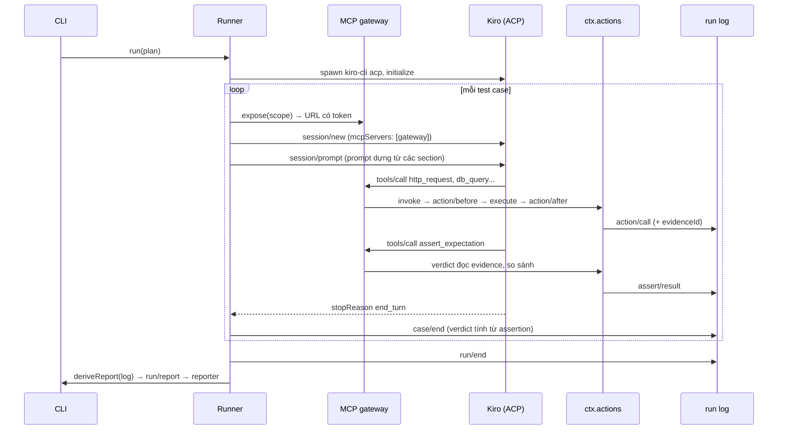

# Kiến trúc aitest

Tài liệu mô tả thiết kế bản khả thi (PoC) của aitest. aitest là nền tảng cho AI agent tự đọc test plan, tự thực thi các bước qua MCP và xuất báo cáo.

## 1. Mục tiêu và phạm vi

| Yêu cầu | Cách đáp ứng |
|---|---|
| Soạn test plan | File `*.plan.yaml` có JSON Schema cho IDE; lệnh `aitest validate` kiểm tra trước khi chạy |
| Bổ sung, sửa action | Mỗi action là một plugin; MCP server bên ngoài nối vào qua plugin `action-mcp-proxy` |
| Mọi thao tác đi qua MCP | Agent chỉ thấy một MCP gateway; mọi lời gọi tool đi qua gateway |
| Mọi thứ là plugin | Kể cả service lõi (`actions`, `plans`, `runlog`...) cũng là plugin thay thế được qua `aitest.yml` |
| Agent qua ACP | Driver `agent-acp` nói Agent Client Protocol; mặc định dùng Kiro (`kiro-cli acp`) |

| Test integration nhiều service | Fixture `setup`/`teardown`, action `wait_until` cho xử lý bất đồng bộ, webhook sink nhận callback |
| Test E2E qua giao diện web | Playwright MCP nối qua `action-mcp-proxy`; agent đối chiếu chéo giao diện với cơ sở dữ liệu |

Ngoài phạm vi PoC: giao diện web của nền tảng, chạy song song nhiều case, phân quyền người dùng.

## 2. Quyết định nền tảng

### 2.1. Tự dựng trên cordis, học theo dsh

Nền tảng dùng `@deepseek-ai/cordis` 4.0.4. Đây là bản cordis mà DeepSeek Harness (dsh) vendor, vá lỗi vòng đời và phát hành trên npm. Bản upstream `cordis` vẫn ở mức `4.0.0-rc`.

Các mẫu thiết kế học từ dsh:

| Mẫu của dsh | Áp dụng trong aitest |
|---|---|
| Plugin đóng góp service, event và effect có thể đảo ngược | Mọi đăng ký (`actions.register`, `prompt.section`...) là effect, tự gỡ khi plugin unload |
| Pipeline tool `pre-execute` / `post-execute` / `result` dạng waterfall | Pipeline action `action/before` / `action/after` / `action/result` |
| Session log append-only là nguồn sự thật | Run log `events.jsonl`; báo cáo luôn được dựng lại từ log |
| Cấu hình dạng "row" có `id`, ghi đè theo `id` | `aitest.yml` gồm các row `id`/`name`/`config`/`disabled` |
| Plugin thiếu service phụ thuộc thì chờ, không ném lỗi | Khai báo `inject` cho mọi plugin |

Kernel tự viết một bộ nạp row tối giản (`packages/core/src/kernel.ts`), chưa dùng `@deepseek-ai/cordis-plugin-loader`. Lý do: loader của dsh gắn chặt với profile, bundle và patch layer, vượt nhu cầu của PoC. Định dạng row đã tương thích về ý tưởng, nên có thể chuyển sang loader đó khi cần hot reload cấu hình.

### 2.2. Agent nằm ngoài, công cụ nằm trong

Agent loop không chạy trong aitest. aitest đóng vai **ACP client** và **MCP host**:

1. Driver khởi chạy `kiro-cli acp` và giao tiếp qua stdio theo ACP.
2. Mỗi test case nhận một endpoint MCP riêng (`http://127.0.0.1:<port>/mcp/<token>`).
3. Runner truyền endpoint này vào `session/new` của ACP dưới dạng MCP server HTTP.
4. Kiro gọi tool qua endpoint đó; gateway chuyển lời gọi vào `ctx.actions.invoke`.

Thiết kế này có ba hệ quả:

- Đổi agent (Kiro, Claude Code, Gemini CLI...) chỉ cần đổi cấu hình driver, miễn agent hỗ trợ ACP.
- aitest quan sát được mọi lời gọi tool ở phía server, không phụ thuộc agent tự báo cáo.
- Kiro 2.26.1 khai báo `mcpCapabilities.http: true`, nên không cần process cầu nối stdio.

### 2.3. LLM không quyết định pass/fail

Đây là nguyên tắc quan trọng nhất của thiết kế. Nếu để LLM tự kết luận, nền tảng sẽ báo pass giả mỗi khi model "tưởng" là đúng.

Cơ chế xác định kết quả:

1. Plugin `verdict` lưu kết quả mỗi action thành evidence, kèm mã `evN` trả về cho agent.
2. Agent gọi `assert_expectation` với `expectId`, `evidenceId` và `path`.
3. Plugin tự đọc giá trị thật tại `path` trong evidence rồi so sánh. Agent không truyền giá trị thực tế.
4. Khi plan khai báo `check`, toán tử và giá trị mong đợi lấy từ plan; agent không thay đổi được.
5. Verdict của case được tính từ assertion của từng expectation.

| Verdict | Điều kiện |
|---|---|
| `pass` | Mọi expectation có assertion đạt |
| `fail` | Ít nhất một expectation có assertion không đạt |
| `inconclusive` | Có expectation chưa được assert, hoặc case không có expectation |
| `error` | Agent lỗi, mất kết nối hoặc vượt `timeout` |

Phần việc còn lại của agent là chọn đúng evidence và đúng path. Báo cáo hiển thị path và giá trị thật của mỗi assertion, nên người đọc kiểm tra lại được lựa chọn này.

## 3. Thành phần

```
packages/
  core/              Kiểu miền, danh mục event, service lõi, kernel nạp plugin
  plan-yaml/         Định dạng test plan *.plan.yaml
  mcp-gateway/       MCP server HTTP trong process, mỗi case một endpoint
  agent-acp/         Driver ACP (mặc định Kiro)
  runner/            Điều phối lượt chạy; prompt mặc định
  verdict/           Evidence, assert_expectation, note_step, tính verdict
  action-http/       Action http_request
  action-sqlite/     Action <namespace>_query cho SQLite
  action-mcp-proxy/  Nối MCP server bên ngoài thành action (Postgres, Playwright...)
  action-wait/       Action wait_until: gọi lặp một action tới khi điều kiện đúng
  action-webhook/    Action webhook_create, webhook_wait: nhận callback từ hệ thống đích
  guard-basic/       Chặn SQL ghi, giới hạn host, chặn action theo tên
  reporters/         console, markdown, junit
  cli/               Lệnh aitest
```

Các plugin chỉ phụ thuộc `@aitest/core` và cordis, không import lẫn nhau. Ngoại lệ duy nhất là `runner` dùng kiểu của `mcp-gateway`.

### 3.1. Service lõi

| Service | Khoá context | Vai trò |
|---|---|---|
| `ActionRegistry` | `ctx.actions` | Đăng ký action; lọc theo namespace của case; chạy pipeline |
| `PlanService` | `ctx.plans` | Đăng ký định dạng plan; chọn định dạng theo đuôi file |
| `AgentRegistry` | `ctx.agents` | Đăng ký driver agent |
| `PromptService` | `ctx.prompt` | Dựng prompt từ các section do plugin đóng góp |
| `RunLogService` | `ctx.runlog` | Tạo và đọc run log append-only |
| `McpGateway` | `ctx.gateway` | Mở endpoint MCP cho từng case |
| `Runner` | `ctx.runner` | Chạy test plan |

### 3.2. Danh mục event

| Event | Kiểu dispatch | Dùng để |
|---|---|---|
| `action/before` | waterfall | Guard: cho phép, từ chối, sửa tham số |
| `action/after` | waterfall | Bổ sung annotation, ví dụ `evidenceId` |
| `action/result` | emit | Quan sát kết quả cuối |
| `case/start` | parallel | Chuẩn bị dữ liệu trước case |
| `case/agent-update` | emit | Theo dõi luồng tin nhắn của agent |
| `case/verdict` | waterfall | Quyết định verdict |
| `case/end` | parallel | Dọn dẹp, thông báo |
| `run/event` | emit | Mỗi bản ghi mới trong run log |
| `run/report` | parallel | Reporter xuất báo cáo |

Listener waterfall không giữ quyết định thì phải `return next()`.

## 4. Luồng một lượt chạy



Mỗi case dùng một session ACP mới, nên ngữ cảnh của case trước không ảnh hưởng case sau. Toàn bộ lượt chạy dùng chung một process agent.

## 5. Định dạng test plan

### 5.1. Tiêu chí lựa chọn

| Tiêu chí | YAML | Markdown + frontmatter | Gherkin | JSON |
|---|---|---|---|---|
| QA không phải lập trình viên đọc và soạn được | Tốt | Rất tốt | Rất tốt | Kém |
| Kiểm tra schema trong IDE | Có (JSON Schema) | Chỉ phần frontmatter | Không | Có |
| Tách tiêu chí cố định (`check`) khỏi văn xuôi | Tự nhiên | Phải quy ước cú pháp riêng | Phải viết step definition | Tự nhiên |
| Parse ổn định, không phụ thuộc quy ước trình bày | Có | Không | Có | Có |
| Diff trong git dễ đọc | Tốt | Tốt | Tốt | Trung bình |
| Bước viết bằng ngôn ngữ tự nhiên cho AI | Có | Có | Có, nhưng gò theo Given/When/Then | Có, nhưng khó đọc |

Kết luận: chọn **YAML**. Phần `steps` là văn xuôi tự do cho agent, còn phần `expect[].check` có cấu trúc để verdict tính xác định. YAML là định dạng duy nhất đạt cả hai yêu cầu mà vẫn có JSON Schema cho IDE.

Định dạng là một plugin (`ctx.plans.registerFormat`). Vì vậy, có thể bổ sung Markdown hoặc Gherkin sau mà không đổi runner.

### 5.2. Cấu trúc

Xem ví dụ đầy đủ tại `examples/plans/order.plan.yaml` và schema tại `docs/plan.schema.json`.

| Trường | Ý nghĩa |
|---|---|
| `requires` | Namespace action được bật cho plan; action ngoài danh sách bị ẩn với agent |
| `vars` | Biến dùng trong steps qua `{{tên}}`; hỗ trợ `${env.NAME:-mặc định}` |
| `context` | Bối cảnh nghiệp vụ: bảng dữ liệu, ràng buộc |
| `cases[].steps` | Các bước bằng ngôn ngữ tự nhiên |
| `cases[].expect[].check` | Tiêu chí cố định; thiếu trường này thì agent tự chọn tiêu chí và báo cáo ghi `criteria: agent` |
| `setup`, `teardown` | Bước fixture ở mức plan (áp dụng cho mọi case) và mức case; xem mục 6.2 |

## 6. Test integration và E2E

Test integration và E2E khác test API đơn lẻ ở ba điểm. Hệ thống xử lý bất đồng bộ, dữ liệu đầu vào phải ổn định giữa các lượt chạy, và có thêm kênh giao diện người dùng. Nền tảng đáp ứng ba điểm này bằng plugin, không đổi runner hay verdict.

| Nhu cầu | Thành phần | Ai thực hiện |
|---|---|---|
| Chờ trạng thái bất đồng bộ ổn định | `wait_until` (plugin `action-wait`) | Agent gọi; điều kiện đánh giá xác định |
| Nhận callback hệ thống đích gửi ra | `webhook_create`, `webhook_wait` (plugin `action-webhook`) | Agent gọi; nền tảng host endpoint |
| Chuẩn bị và dọn dữ liệu | `setup`, `teardown` trong plan | Runner chạy, không qua AI |
| Thao tác giao diện web | Playwright MCP qua `action-mcp-proxy` | Agent gọi các tool `browser_*` |

### 6.1. Xử lý bất đồng bộ

`wait_until` gọi lặp một action khác cho tới khi giá trị tại `path` thoả điều kiện, hoặc hết thời gian. Điều kiện dùng cùng bộ so khớp với assertion, nên kết quả chờ không phụ thuộc phán đoán của LLM.

- Mỗi lần gọi lặp đều đi qua guard và được ghi vào run log.
- Hết thời gian không phải lỗi: action trả `satisfied: false` kèm giá trị cuối và `evidenceId`. Agent vẫn assert như bình thường, và verdict ghi nhận `fail`.
- `action-wait` giới hạn thời gian chờ tối đa (`maxTimeout`, mặc định 300 giây) và khoảng cách tối thiểu giữa hai lần gọi (`minInterval`, mặc định 200 ms).

`webhook_create` tạo một URL riêng cho case. Agent truyền URL này cho hệ thống đích, ví dụ trong trường `callback_url`. `webhook_wait` chờ tới khi URL nhận đủ số request rồi trả về method, header và body. Sink tự đóng khi case kết thúc. Khi hệ thống đích chạy trong Docker hoặc trên máy khác, khai báo `publicBaseUrl` để hệ thống đích gọi tới được.

### 6.2. Fixture

Fixture là bước chuẩn bị hoặc dọn dẹp dữ liệu. Runner thực thi fixture một cách xác định, theo thứ tự sau:

1. `plan.setup`, rồi `case.setup`: lỗi ở bước nào thì case nhận verdict `error`, agent không được gọi.
2. Agent thực hiện case.
3. `case.teardown`, rồi `plan.teardown`: luôn chạy, kể cả khi case lỗi hoặc vượt thời gian.

```yaml
setup:
  - desc: Tạo sẵn một lệnh NEW
    action: dbadmin_query
    args:
      sql: "INSERT INTO orders (symbol, side, qty, price, status) VALUES ('MWG', 'SELL', 100, 61000, 'NEW') RETURNING id"
    save: { order_id: '$.rows[0].id' }
steps:
  - Gọi POST {{base_url}}/orders/{{order_id}}/cancel.
```

`save` lưu giá trị từ kết quả thành biến. Runner thay `{{order_id}}` trong steps, expectation và tham số fixture sau đó. Chuỗi chỉ gồm đúng một placeholder thì giữ nguyên kiểu của biến, ví dụ số nguyên.

Fixture được gọi mọi action đã đăng ký, không bị giới hạn bởi `requires`. Nhờ đó, kết nối ghi DB (`dbadmin`) chỉ dùng trong fixture, còn agent chỉ thấy kết nối chỉ đọc (`db`).

### 6.3. E2E qua trình duyệt

File `aitest.e2e.yml` kế thừa `aitest.yml` qua khoá `extends`, rồi thêm row Playwright MCP:

```yaml
extends: ./aitest.yml
plugins:
  - id: action-browser
    name: '@aitest/action-mcp-proxy'
    config:
      namespace: browser
      prefix: ''          # tool của Playwright đã có tiền tố browser_
      command: ./node_modules/.bin/playwright-mcp
      args: ['--headless', '--isolated', '--browser', 'chrome']
      exclude: [browser_run_code_unsafe, browser_evaluate, browser_file_upload]
```

Agent đọc trang bằng `browser_snapshot`, thao tác bằng `browser_fill_form`, `browser_click` theo `ref` trong snapshot. Kết quả snapshot là văn bản, nên expectation giao diện dùng toán tử `contains` hoặc `matches` với path `$`. Mỗi case E2E nên đối chiếu chéo với DB, vì giao diện có thể hiển thị đúng trong khi dữ liệu ghi sai.

Cấu hình loại bỏ các tool chạy mã tuỳ ý trong trang. Teardown `browser_close` giúp mỗi case bắt đầu với trình duyệt sạch.

### 6.4. Kiểm thử chính các năng lực này

Bộ kiểm thử tự động dùng agent kịch bản đi qua MCP gateway thật, không cần LLM:

| File | Nội dung |
|---|---|
| `packages/runner/tests/e2e.test.ts` | Luồng API, guard, replay báo cáo, nạp và gỡ plugin |
| `packages/runner/tests/integration.test.ts` | Webhook, `wait_until` có poll lặp, fixture có `save`, setup lỗi |
| `packages/runner/tests/browser.test.ts` | Điều khiển Chrome qua Playwright MCP; bỏ qua bằng `AITEST_SKIP_BROWSER=1` |

## 7. Hướng dẫn mở rộng

Mọi điểm mở rộng đều theo cùng một cách: viết một module export plugin cordis, rồi thêm một row vào `aitest.yml`.

### 7.1. Thêm action nội bộ

```ts
import { z, type Context } from '@aitest/core'

export const name = 'action-kafka'
export const inject = ['actions']
export const Config = z.object({ brokers: z.array(z.string()).required() })

export function apply(ctx: Context, config: { brokers: string[] }) {
  ctx.actions.register({
    name: 'kafka_consume',
    namespace: 'kafka',
    readOnly: true,
    description: 'Đọc tối đa N bản tin mới nhất của một topic.',
    inputSchema: { type: 'object', properties: { topic: { type: 'string' } }, required: ['topic'] },
    async execute(args, { signal }) { /* ... */ },
  })
}
```

Ví dụ chạy được: `examples/plugins/action-clock.ts`.

### 7.2. Nối MCP server có sẵn

Không cần viết code. Thêm một row dùng `@aitest/action-mcp-proxy`:

```yaml
- id: action-pg
  name: '@aitest/action-mcp-proxy'
  config:
    namespace: pg
    command: npx
    args: ['-y', '@modelcontextprotocol/server-postgres', '${env.PG_URL}']
```

Tool `query` của server được đăng ký thành action `pg_query`. Lời gọi vẫn đi qua guard, evidence và run log.

### 7.3. Thêm guard

Lắng nghe `action/before`, trả `{ type: 'deny', reason }` để chặn, hoặc `next()` để chuyển tiếp. Xem `packages/guard-basic`.

### 7.4. Thêm agent

- Agent hỗ trợ ACP: thêm row `@aitest/agent-acp` với `name`, `command`, `args` khác.
- Agent không hỗ trợ ACP: viết plugin gọi `ctx.agents.register(driver)` theo interface `AgentDriver`. Ví dụ tham khảo là driver kịch bản trong `packages/runner/tests/support.ts`.

### 7.5. Thêm reporter

Lắng nghe `run/report` và nhận `RunReport` đã dựng sẵn. Xem `packages/reporters/src/*.ts`.

### 7.6. Thay service lõi

Khai báo row có cùng `id` với service lõi (`actions`, `plans`, `agents`, `prompt`, `runlog`). Ví dụ, để lưu run log vào object storage, thay row `runlog` bằng plugin của bạn.

### 7.7. Xếp lớp cấu hình

Khoá `extends` nhận một hoặc nhiều file cấu hình cha. Row của file con ghi đè row cùng `id` của file cha. `name` tương đối được phân giải theo thư mục của file khai báo row đó.

## 8. Kết quả kiểm chứng PoC

Các phép đo dưới đây thực hiện ngày 01/10/2026 trên macOS, Node 22.23, Kiro CLI 2.26.1, Google Chrome và Playwright MCP 0.0.83.

| Kịch bản | Kết quả |
|---|---|
| Bộ kiểm thử tự động với agent kịch bản (`pnpm test`) | 15/15 đạt, khoảng 9 s |
| Kiro chạy `order.plan.yaml` (API) | TC-01 pass, TC-02 pass, TC-03 fail đúng do lỗi cố ý; tổng 80,6 s |
| Kiro chạy `order-integration.plan.yaml` | IT-01 (webhook và `wait_until`) pass, IT-02 (fixture có `save`) pass; tổng 91,0 s |
| Kiro chạy `order-ui.plan.yaml` qua Chrome | E2E-01 pass, E2E-02 pass; tổng 89,8 s |
| Replay báo cáo từ `events.jsonl` | Báo cáo dựng lại trùng với báo cáo gốc |
| Guard chặn `DELETE` trên namespace `db` chỉ đọc | Action trả trạng thái `denied` |

Phát hiện trong lần chạy đầu với Kiro: agent viết path `$.result.status` vì kết quả tool bọc giá trị trong trường `result`. Ba assertion đầu tiên không đạt, sau đó agent tự sửa path. Cách khắc phục đã áp dụng:

- `readPath` thử lại sau khi bỏ tiền tố `$.result` nếu path gốc không có giá trị.
- Trường trạng thái của gateway đổi tên thành `outcome` để không trùng với HTTP status.
- Báo cáo ghi mọi lần assert; cấu hình `verdict.allowRetry: false` bật chính sách chỉ tính lần đầu.

Sau khắc phục, mọi assertion của Kiro trong cả ba plan đều chọn đúng evidence và đúng path ngay lần đầu. Với plan giao diện, Kiro assert trên snapshot chụp sau khi gửi lệnh, không dùng snapshot trước đó.

## 9. Rủi ro và đánh đổi

| Vấn đề | Đánh đổi hiện tại | Hướng xử lý |
|---|---|---|
| Agent chọn sai evidence hoặc path nhưng vô tình khớp giá trị | Báo cáo hiển thị path và giá trị thật để người đọc kiểm tra | Thêm `check.path` gợi ý trong plan; cảnh báo khi path trỏ vào evidence của action không liên quan |
| Cho phép assert lại làm lộ khả năng agent "thử tới khi đạt" | Mặc định cho phép để agent sửa path sai; báo cáo ghi số lần thử | Đặt `allowRetry: false` cho môi trường CI nghiêm ngặt |
| Kiro có thể nạp MCP server từ cấu hình người dùng | Chính sách `permission: gateway-only` từ chối tool ngoài gateway | Dùng Kiro agent profile riêng, không khai báo MCP server nào |
| Prompt bằng tiếng Việt | Kiro hiểu tốt trong PoC | Tách section prompt theo ngôn ngữ nếu cần |
| Assert `contains` trên snapshot toàn trang có thể đạt nhầm, ví dụ chữ VCB nằm trong ô nhập liệu chứ không nằm trong bảng | Kết hợp đối chiếu chéo với DB trong cùng case | Hướng dẫn agent chụp snapshot theo `target` của vùng cần kiểm tra; thêm toán tử so khớp theo vai trò phần tử |
| Trình duyệt dùng chung giữa các case | Teardown `browser_close` đưa trình duyệt về trạng thái sạch | Một process Playwright MCP cho mỗi case khi cần cô lập tuyệt đối |
| Một process agent cho cả lượt chạy | Tiết kiệm thời gian khởi động | Thêm tuỳ chọn mỗi case một process khi cần cô lập tuyệt đối |

## 10. Lộ trình

1. **Ổn định lõi:** chạy song song nhiều case, tham số hoá case theo bảng dữ liệu, chia sẻ biến giữa các case.
2. **Action phổ biến:** Postgres, Kafka, Redis, gRPC; quản lý môi trường bằng Docker Compose hoặc Testcontainers ở fixture.
3. **Soạn plan:** plugin định dạng Markdown, lệnh `aitest new` sinh khung plan, agent hỗ trợ sinh plan từ đặc tả API.
4. **Giao diện web:** soạn plan có kiểm tra schema, xem lại chuỗi tool call của từng case, so sánh giữa các lượt chạy.
5. **Hot reload:** chuyển kernel sang `@deepseek-ai/cordis-plugin-loader` để thay plugin mà không khởi động lại.

## Thuật ngữ mới

| Thuật ngữ | Nhóm | Ghi chú |
|---|---|---|
| test plan, test case | A | Danh từ chỉ tài liệu kiểm thử; giữ nguyên |
| evidence | A | Kết quả action được lưu để đối chiếu |
| assertion | A | Một lần đối chiếu expectation với evidence |
| expectation | A | Kết quả mong đợi khai báo trong plan |
| verdict | A | Kết luận pass/fail/error/inconclusive của case |
| run log | A | Nhật ký append-only của một lượt chạy |
| plugin, action, guard, reporter, driver | A | Thành phần kiến trúc |
| lượt chạy | B | Dịch của "run" |
| fixture | A | Bước chuẩn bị hoặc dọn dẹp dữ liệu do runner chạy |
| webhook, callback, snapshot | A | Giữ nguyên |
