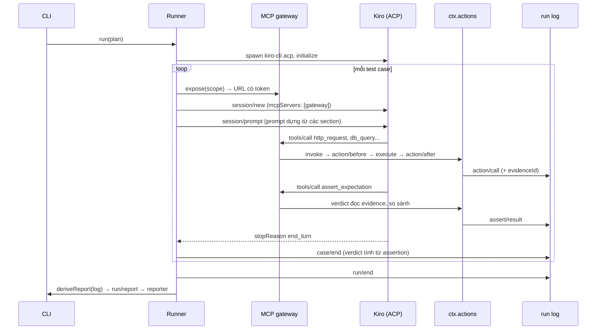

# Kiến trúc aitest

Tài liệu mô tả thiết kế bản khả thi (PoC) của aitest. aitest là nền tảng cho AI agent tự đọc test plan, tự thực thi các bước qua MCP và xuất báo cáo.

## 1. Mục tiêu và phạm vi

| Yêu cầu | Cách đáp ứng |
|---|---|
| Soạn test plan | File `*.plan.yaml` có JSON Schema cho IDE; lệnh `aitest validate` kiểm tra trước khi chạy |
| Bổ sung, sửa action | Mỗi action là một plugin; MCP server bên ngoài nối vào qua plugin `action-mcp-proxy` |
| Mọi thao tác đi qua MCP | Agent chỉ thấy một MCP gateway; mọi lời gọi tool đi qua gateway |
| Mọi thứ là plugin | Kể cả service lõi (`actions`, `plans`, `runlog`...) cũng là plugin thay thế được qua `aitest.yml` |
| Agent qua ACP | Driver `agent-acp` nói Agent Client Protocol; mặc định dùng Kiro (`kiro-cli acp`) |

| Test integration nhiều service | Fixture `setup`/`teardown`, action `wait_until` cho xử lý bất đồng bộ, webhook sink nhận callback |
| Test E2E qua giao diện web | Playwright MCP nối qua `action-mcp-proxy`; agent đối chiếu chéo giao diện với cơ sở dữ liệu |
| Soạn plan cùng AI qua giao diện chat | Giao diện web theo mô hình của dsh; agent dùng tool soạn plan qua MCP gateway |

Ngoài phạm vi PoC: chạy song song nhiều case, đăng nhập và phân quyền người dùng trên giao diện web.

## 2. Quyết định nền tảng

### 2.1. Tự dựng trên cordis, học theo dsh

Nền tảng dùng `@deepseek-ai/cordis` 4.0.4. Đây là bản cordis mà DeepSeek Harness (dsh) vendor, vá lỗi vòng đời và phát hành trên npm. Bản upstream `cordis` vẫn ở mức `4.0.0-rc`.

Các mẫu thiết kế học từ dsh:

| Mẫu của dsh | Áp dụng trong aitest |
|---|---|
| Plugin đóng góp service, event và effect có thể đảo ngược | Mọi đăng ký (`actions.register`, `prompt.section`...) là effect, tự gỡ khi plugin unload |
| Pipeline tool `pre-execute` / `post-execute` / `result` dạng waterfall | Pipeline action `action/before` / `action/after` / `action/result` |
| Session log append-only là nguồn sự thật | Run log `events.jsonl`; báo cáo luôn được dựng lại từ log |
| Cấu hình dạng "row" có `id`, ghi đè theo `id` | `aitest.yml` gồm các row `id`/`name`/`config`/`disabled` |
| Plugin thiếu service phụ thuộc thì chờ, không ném lỗi | Khai báo `inject` cho mọi plugin |

Kernel tự viết một bộ nạp row tối giản (`packages/core/src/kernel.ts`), chưa dùng `@deepseek-ai/cordis-plugin-loader`. Lý do: loader của dsh gắn chặt với profile, bundle và patch layer, vượt nhu cầu của PoC. Định dạng row đã tương thích về ý tưởng, nên có thể chuyển sang loader đó khi cần hot reload cấu hình.

### 2.2. Agent nằm ngoài, công cụ nằm trong

Agent loop không chạy trong aitest. aitest đóng vai **ACP client** và **MCP host**:

1. Driver khởi chạy `kiro-cli acp` và giao tiếp qua stdio theo ACP.
2. Mỗi test case nhận một endpoint MCP riêng (`http://127.0.0.1:<port>/mcp/<token>`).
3. Runner truyền endpoint này vào `session/new` của ACP dưới dạng MCP server HTTP.
4. Kiro gọi tool qua endpoint đó; gateway chuyển lời gọi vào `ctx.actions.invoke`.

Thiết kế này có ba hệ quả:

- Đổi agent (Kiro, Claude Code, Gemini CLI...) chỉ cần đổi cấu hình driver, miễn agent hỗ trợ ACP.
- aitest quan sát được mọi lời gọi tool ở phía server, không phụ thuộc agent tự báo cáo.
- Kiro 2.26.1 khai báo `mcpCapabilities.http: true`, nên không cần process cầu nối stdio.

### 2.3. LLM không quyết định pass/fail

Đây là nguyên tắc quan trọng nhất của thiết kế. Nếu để LLM tự kết luận, nền tảng sẽ báo pass giả mỗi khi model "tưởng" là đúng.

Cơ chế xác định kết quả:

1. Plugin `verdict` lưu kết quả mỗi action thành evidence, kèm mã `evN` trả về cho agent.
2. Agent gọi `assert_expectation` với `expectId`, `evidenceId` và `path`. Một lời gọi nhận nhiều expectation qua `assertions: [...]`; phần tử sai tham số trả lỗi riêng, không làm hỏng phần tử khác. Gộp như vậy giảm số lượt suy nghĩ của agent, vốn chiếm phần lớn thời gian chạy.
3. Plugin tự đọc giá trị thật tại `path` trong evidence rồi so sánh. Agent không truyền giá trị thực tế.
4. Khi plan khai báo `check`, toán tử và giá trị mong đợi lấy từ plan; agent không thay đổi được.
5. Verdict của case được tính từ assertion của từng expectation.

Gateway ghi `step` cho mọi lời gọi tool, nên hành trình theo bước không cần agent tự ghi. Agent chỉ gọi `note_step` khi một bước thất bại hoặc bị bỏ qua, kèm lý do.

| Verdict | Điều kiện |
|---|---|
| `pass` | Mọi expectation có assertion đạt |
| `fail` | Ít nhất một expectation có assertion không đạt |
| `inconclusive` | Có expectation chưa được assert, hoặc case không có expectation |
| `error` | Agent lỗi, mất kết nối hoặc vượt `timeout` |

**Giá trị mong đợi phải tính toán** (phí, tổng tiền, giá trần) dùng `check.expr` thay cho `check.value`, ví dụ `round(qty * price / 1000 * 0.0015, 2, HALF_UP)`. Plan cố định công thức; khi assert, agent truyền `inputs` chỉ ra evidence và path chứa từng biến; plugin `verdict` đọc giá trị thật qua `ctx.evidence` và tính trên BigDecimal trong core (`calculate`, dựa trên bigdecimal.js, cùng ngữ nghĩa `java.math.BigDecimal`). Agent không tự tính giá trị mong đợi, nên không có sai số tính nhẩm và không có lỗi chép số.

Quy tắc tính: `+ - * %` chính xác và giữ đủ phần thập phân; `/` chia không hết là lỗi, phải dùng `div(a, b, scale, MODE)`. **Không có cách làm tròn mặc định**: mọi hàm làm tròn (`round`, `roundStep`, `roundSig`, `div`, `sqrt`) bắt buộc ghi cách làm tròn (`HALF_UP`, `HALF_EVEN`, `FLOOR`…), vì mỗi tính năng có quy tắc riêng. Phép so sánh số (`eq`, `gt`…) dùng BigDecimal `compareTo`, không qua số thực. `action-http` parse JSON không mất chữ số: số vượt độ chính xác của `number` được giữ dạng chuỗi.

Ngoài assertion, agent dùng tool `calc` (biểu thức) và `round_number` (làm tròn một giá trị) của plugin `action-math`. Đầu vào nhận số, chuỗi số hoặc tham chiếu evidence; kết quả cũng là evidence. Bộ tính tự phân tích cú pháp, chỉ nhận số, biến, cách làm tròn, toán tử và một danh sách hàm cố định; không dùng `eval`.

Phần việc còn lại của agent là chọn đúng evidence và đúng path. Báo cáo hiển thị path và giá trị thật của mỗi assertion, nên người đọc kiểm tra lại được lựa chọn này.

## 3. Thành phần

```
packages/
  core/              Kiểu miền, danh mục event, service lõi, kernel nạp plugin
  plan-yaml/         Định dạng test plan *.plan.yaml
  mcp-gateway/       MCP server HTTP trong process, mỗi case một endpoint
  agent-acp/         Driver ACP (mặc định Kiro)
  runner/            Điều phối lượt chạy; prompt mặc định
  verdict/           Evidence, assert_expectation, note_step, tính verdict
  action-http/       Action http_request
  action-sqlite/     Action <namespace>_query cho SQLite
  action-mcp-proxy/  Nối MCP server bên ngoài thành action (Postgres, Playwright...)
  action-math/       Action calc, round_number: tính toán và làm tròn trên BigDecimal, biến lấy từ evidence
  action-wait/       Action wait_until: gọi lặp một action tới khi điều kiện đúng
  action-webhook/    Action webhook_create, webhook_wait: nhận callback từ hệ thống đích
  guard-basic/       Chặn SQL ghi, giới hạn host, chặn action theo tên
  reporters/         console, markdown, junit
  authoring/         Soạn plan cùng agent: service lõi và các plugin catalog, context-files, explore, validate, dry-run, save
  chat/              Cuộc chat soạn plan: log append-only, cầu nối ACP sang event, duyệt quyền
  web-host/          HTTP và WebSocket; registry method theo mẫu Remote của dsh
  plugin-manager/    Quản lý plugin, tool, MCP server từ giao diện; ghi patch layer
  knowledge/         Tri thức của nhóm: lỗi đã biết, quy ước, bài học (thư mục kb/)
  context/           Thư viện ngữ cảnh: thư mục context/ và skill theo chuẩn Agent Skills (mục 7.9)
  memory/            Bộ nhớ giữa các phiên của agent soạn plan (mục 7.9)
  plan-bundle/       Gói plan để chuyển giữa các aitest: plan, tài liệu contextRefs, hệ thống (mục 7.7)
  open-items/        Việc còn mở: điều chưa chốt, nhắc lại ở lượt sau và cuộc chat sau (mục 7.9)
  run-viewer/        Xem log lượt chạy trên giao diện, theo dõi lượt chạy đang diễn ra
  web-client/        Giao diện React + Vite; plugin phía client đăng ký vào slot
  cli/               Lệnh aitest
```

Các plugin chỉ phụ thuộc `@aitest/core` và cordis, không import lẫn nhau. Ngoại lệ: `runner` dùng kiểu của `mcp-gateway`; `authoring` dùng kiểu của `runner`; `chat` dùng `authoring`, `mcp-gateway` và `web-host`.

### 3.1. Service lõi

| Service | Khoá context | Vai trò |
|---|---|---|
| `ActionRegistry` | `ctx.actions` | Đăng ký action; lọc theo loại scope và namespace; chạy pipeline; ghi `action/start`, `action/call` kèm `view` |
| `PlanService` | `ctx.plans` | Đăng ký định dạng plan; chọn định dạng theo đuôi file |
| `AgentRegistry` | `ctx.agents` | Đăng ký driver agent |
| `PromptService` | `ctx.prompt` | Dựng prompt từ các section do plugin đóng góp |
| `RunLogService` | `ctx.runlog` | Tạo và đọc run log append-only |
| `McpGateway` | `ctx.gateway` | Mở endpoint MCP cho từng case |
| `Runner` | `ctx.runner` | Chạy test plan |
| `AuthoringService` | `ctx.authoring` | Phiên soạn plan, nguồn context, hướng dẫn cho agent, kiểm tra plan |
| `ChatService` | `ctx.chats` | Cuộc chat soạn plan với agent |
| `WebHost` | `ctx.web` | HTTP, WebSocket và registry method |
| `EvidenceReader` | `ctx.evidence` | Đọc giá trị thật trong evidence theo `{ evidenceId, path }`; plugin `verdict` cung cấp |
| `Kernel` | `ctx.kernel` | Row plugin lúc chạy: trạng thái, bật/tắt, cấu hình, thêm/gỡ, patch layer |

Action chạy trong một **scope** có loại `case` (test case), `authoring` (phiên soạn plan) hoặc `explore` (khảo sát chỉ đọc từ phiên soạn plan). Mỗi action khai báo `scopes`; mặc định là `case` và `explore`. Tool soạn plan khai báo `authoring`, nên agent chạy test không bao giờ thấy chúng, và ngược lại.

### 3.2. Danh mục event

| Event | Kiểu dispatch | Dùng để |
|---|---|---|
| `action/before` | waterfall | Guard: cho phép, từ chối, sửa tham số |
| `action/after` | waterfall | Bổ sung annotation, ví dụ `evidenceId` |
| `action/result` | emit | Quan sát kết quả cuối |
| `case/start` | parallel | Chuẩn bị dữ liệu trước case |
| `case/steps` | waterfall | Chạy bước đầu case không qua agent (bước `call:`); trả số bước đã xong |
| `case/step-done` | parallel | Một bước nền tảng chạy đã xong; `verdict` đối chiếu expectation `from` |
| `case/agent-update` | emit | Theo dõi luồng tin nhắn của agent |
| `case/verdict` | waterfall | Quyết định verdict |
| `case/end` | parallel | Dọn dẹp, thông báo |
| `run/event` | emit | Mỗi bản ghi mới trong run log |
| `run/report` | parallel | Reporter xuất báo cáo |
| `authoring/lint` | parallel | Bổ sung lỗi, cảnh báo khi kiểm tra plan |
| `authoring/stop` | emit | Người dùng dừng lượt của phiên soạn plan; plugin dừng việc chạy nền của phiên (lượt chạy thử) |
| `chat/live` | emit | Token đang stream và trạng thái của cuộc chat; không ghi log |

Event ghi vào run log mà plugin dùng chung: `case/annotation` (`{ key, value }`) gắn thông tin vào case; `deriveReport` đưa vào `CaseReport.annotations`.

**Góp ý của agent chạy test.** Plugin `@aitest/verdict/feedback` đăng ký tool `feedback_submit` (scope `case`) và section prompt `verdict/feedback`. Agent chạy test góp ý khi plan làm agent phải đoán.

- Mỗi góp ý ghi event `case/feedback` (`kind`, `message`, `suggestion`, `step`, `expectId`); `deriveReport` đưa vào `CaseReport.feedback`.
- Tối đa `maxPerCase` góp ý mỗi case; góp ý trùng bị bỏ qua; `step` và `expectId` phải có trong case.
- Góp ý không ảnh hưởng verdict.
- Góp ý hiện ở:
  - `get_run_result` của chạy thử: trường `feedback` của từng case và `nextStep` dặn agent soạn plan trình bày đề xuất sửa, hỏi người dùng chọn rồi mới sửa.
  - Lượt chạy thử người dùng bấm trên bảng plan: `Chat.invoke` không ghi chú cho kết quả `running`; kết quả cuối thành một ghi chú theo khoá `run:<runId>` (thay ghi chú cũ cùng khoá) gồm verdict từng case, mọi góp ý và chỉ dẫn đề xuất. Nút "Nhờ agent đề xuất sửa plan" gửi tin nhắn để agent đề xuất ngay.
  - Bảng Chạy thử trong cuộc chat.
  - Màn hình lượt chạy.
  - `RunSummary.feedback` của `runs.list`.
  - `report.md`.

**Tiến trình chạy thử trực tiếp.** `runs.subscribe` nhận theo dõi cả lượt chạy chưa tạo log (bảng plan đăng ký ngay khi `dry_run` trả `runId`): server chờ file log xuất hiện tối đa 60 giây rồi đẩy event như thường. Phần còn lại: Mục "Chạy thử" của bảng plan nhúng `RunProgress` (web-client). Thành phần này theo dõi run log qua `runs.subscribe`, cùng nguồn với trang Lượt chạy. Mỗi case hiện các hoạt động theo thứ tự:

- `action/start` và `action/call` kèm lý do của agent.
- `step/note`, `assert/result`, `case/feedback`.

**Dừng giữa chừng.** `ActionRegistry` cấp cho mỗi lời gọi một `signal` riêng, nối với `signal` của scope.

- `ctx.actions.cancel(callId)` dừng đúng một lời gọi; `ctx.actions.running(scopeId?)` liệt kê lời gọi đang chạy.
- Lời gọi bị dừng trả về ngay, kể cả khi action không tự dừng theo signal. Kết quả có `status: error`, `annotations.cancelled`, và thông báo dặn agent không tự gọi lại. Scope bị huỷ (case quá thời gian, lượt chạy bị dừng) cũng kết thúc lời gọi đang chạy.
- `RunOptions.signal` dừng lượt chạy:
  - Case đang chạy nhận verdict `error` "run cancelled" nhưng vẫn chạy teardown.
  - Case chưa chạy ghi `error` mà không gọi agent.
  - Bước dọn của lượt chạy vẫn chạy.
  - Runner ghi `run/cancelled`; `deriveReport` đưa lý do vào `report.cancelled`.
- Trong cuộc chat:
  - Nút Dừng trên thẻ tool gọi `chats.cancelTool`.
  - Nút "Dừng chạy thử" trên bảng plan gọi `chats.stopDryRun(runId)`: huỷ lời gọi `get_run_result` đang chờ, phát `authoring/stop` (không dừng lượt của agent), rồi đọc kết quả cuối với pha `user` để log có trạng thái đã dừng và agent được báo ở lượt sau.
  - Nút Dừng của cả lượt huỷ lượt của agent, các lời gọi đang chạy và phát `authoring/stop`.
  - Plugin `authoring/dry-run` dừng lượt chạy thử khi lời gọi `get_run_result` đang chờ bị dừng, hoặc khi nhận `authoring/stop`.
- Trang Plan dừng lượt chạy do chính Host đó khởi động qua `plans.cancel`.

Listener waterfall không giữ quyết định thì phải `return next()`.

## 4. Luồng một lượt chạy



Mỗi case dùng một session ACP mới, nên ngữ cảnh của case trước không ảnh hưởng case sau. Lượt chạy tuần tự dùng chung một process agent.

**Chạy song song.** Plan khai báo `concurrency: N` khi các case độc lập; `RunOptions.concurrency` (CLI `--parallel N`) thắng giá trị của plan. Số luồng bị giới hạn bởi `maxConcurrency` của runner (mặc định 4) và số case. Mỗi luồng lấy case kế tiếp trong hàng đợi. Luồng thứ hai trở đi mở kết nối agent riêng ở case đầu tiên và ghi `agent/connected` kèm `slot`; không mở được thì ghi `agent/connect-failed` rồi dùng chung kết nối chính. Event của các case xen kẽ trong run log nhưng mỗi event mang `caseId`, nên `deriveReport` dựng đúng từng case. Bước chuẩn bị (`run/prepare`) chạy trước mọi case; dọn dữ liệu của lượt chạy chạy sau khi mọi luồng kết thúc. Khi chạy song song, ứng dụng dưới kiểm thử ghi DB cùng lúc với tool đọc. Vì vậy, `action-sqlite` chờ khoá tối đa `busyTimeout` (mặc định 5000 ms) thay vì trả lỗi "database is locked" ngay.

## 5. Định dạng test plan

### 5.1. Tiêu chí lựa chọn

| Tiêu chí | YAML | Markdown + frontmatter | Gherkin | JSON |
|---|---|---|---|---|
| QA không phải lập trình viên đọc và soạn được | Tốt | Rất tốt | Rất tốt | Kém |
| Kiểm tra schema trong IDE | Có (JSON Schema) | Chỉ phần frontmatter | Không | Có |
| Tách tiêu chí cố định (`check`) khỏi văn xuôi | Tự nhiên | Phải quy ước cú pháp riêng | Phải viết step definition | Tự nhiên |
| Parse ổn định, không phụ thuộc quy ước trình bày | Có | Không | Có | Có |
| Diff trong git dễ đọc | Tốt | Tốt | Tốt | Trung bình |
| Bước viết bằng ngôn ngữ tự nhiên cho AI | Có | Có | Có, nhưng gò theo Given/When/Then | Có, nhưng khó đọc |

Kết luận: chọn **YAML**. Phần `steps` là văn xuôi tự do cho agent, còn phần `expect[].check` có cấu trúc để verdict tính xác định. YAML là định dạng duy nhất đạt cả hai yêu cầu mà vẫn có JSON Schema cho IDE.

Định dạng là một plugin (`ctx.plans.registerFormat`). Vì vậy, có thể bổ sung Markdown hoặc Gherkin sau mà không đổi runner.

### 5.2. Cấu trúc

Xem ví dụ đầy đủ tại `examples/plans/order.plan.yaml` và schema tại `docs/plan.schema.json`.

| Trường | Ý nghĩa |
|---|---|
| `requires` | Namespace action được bật cho plan; action ngoài danh sách bị ẩn với agent |
| `vars` | Biến dùng trong steps qua `{{tên}}`; hỗ trợ `${env.NAME:-mặc định}` |
| `context` | Bối cảnh nghiệp vụ: bảng dữ liệu, ràng buộc |
| `cases[].steps` | Các bước bằng ngôn ngữ tự nhiên |
| `cases[].expect[].check` | Tiêu chí cố định; thiếu trường này thì agent tự chọn tiêu chí và báo cáo ghi `criteria: agent` |
| `cases[].expect[].check.expr` | Công thức tính giá trị mong đợi từ dữ liệu lúc chạy, thay cho `value` |
| `setup`, `teardown` | Bước fixture ở mức plan (áp dụng cho mọi case) và mức case; xem mục 6.2 |

### 5.3. Catalog hệ thống và môi trường

Plan chỉ nêu cần kiểm tra gì. Ba lớp còn lại tách khỏi plan để dùng lại:

| Lớp | Nơi khai báo | Trả lời |
|---|---|---|
| Tool | Row plugin trong `aitest.yml`, `tool-catalog/` | Gọi bằng gì: `http_request`, `kafka_wait_for` |
| Mô hình hệ thống | `systems/<id>/service.yml` | Có gì để gọi: operation, kênh sự kiện, consumer, dữ liệu |
| Môi trường | `envs/<tên>.yml` | Gọi ở đâu: URL, broker nào ứng với namespace tool nào |

**Mô hình.** Operation HTTP lấy từ OpenAPI 3 của service theo `operationId`; `$ref` nội bộ được thay bằng nội dung. Phần OpenAPI không có được khai báo trong `service.yml`. Kafka tách hai khái niệm: **kênh sự kiện** (topic hoặc exchange, cùng `correlation` để lọc bản tin) là đơn vị hợp đồng, và **consumer** (group, `effects`) là đơn vị xử lý. Kiểm thử quan sát trên kênh và kiểm tra hệ quả của consumer. Kênh chỉ ghi tên broker logic; môi trường ánh xạ broker sang namespace tool, nên catalog không chứa địa chỉ hay bí mật.

**Plugin.** Service `@aitest/system-catalog` (`ctx.systems`) đọc lại catalog ở đầu mỗi case của plan có `systems`:

- Listener `case/start` ghi biến `<system>.url` vào `scope.vars` trước fixture, rồi ghi event `systems/resolved` vào run log. Runner không đổi, vì fixture và bước được thay biến sau `case/start`.
- Section prompt `systems/context` (thứ tự 15) mô tả operation, kênh, consumer của các hệ thống được khai báo, và **ngữ cảnh dùng chung**: bảng, cột (kiểu, ý nghĩa, giá trị hợp lệ kèm nghĩa), quy tắc của bảng và quy tắc nghiệp vụ của service (`describeKnowledge`, dùng chung với `get_system_context`). Cột viết một dòng bị YAML tách tại dấu phẩy (khoá lạ, giá trị không có nghĩa) là lỗi nạp catalog.

Plugin `@aitest/system-catalog/authoring` cung cấp `list_systems`, `describe_system` cho agent soạn plan và quy tắc kiểm tra qua `authoring/lint`. Mỗi kênh sự kiện trong kết quả có trường `tool { namespace, available }`, tính từ ánh xạ broker của môi trường và registry action lúc gọi (tool bị tắt không được tính). Khi thiếu tool, trường `hint` hướng agent tra `list_tool_catalog` theo namespace; plugin không phụ thuộc `tool-catalog`. Kênh được dùng trong bước mà chưa có tool là lỗi kiểm tra plan. Quy tắc biến chung của `authoring` bỏ qua `{{<system>.*}}`; quy tắc của catalog kiểm tra khoá đó.

**Hướng mở rộng.** Tool cấp nghiệp vụ `api_call {system, operation}` và `event_wait {system, channel}` phân giải từ catalog rồi giao cho `http_request`, `kafka_wait_for`. Nhập AsyncAPI cho kênh sự kiện. Thêm tool `kafka_consumer_lag` để chờ consumer xử lý xong.

## 6. Test integration và E2E

Test integration và E2E khác test API đơn lẻ ở ba điểm. Hệ thống xử lý bất đồng bộ, dữ liệu đầu vào phải ổn định giữa các lượt chạy, và có thêm kênh giao diện người dùng. Nền tảng đáp ứng ba điểm này bằng plugin, không đổi runner hay verdict.

| Nhu cầu | Thành phần | Ai thực hiện |
|---|---|---|
| Chờ trạng thái bất đồng bộ ổn định | `wait_until` (plugin `action-wait`) | Agent gọi; điều kiện đánh giá xác định |
| Nhận callback hệ thống đích gửi ra | `webhook_create`, `webhook_wait` (plugin `action-webhook`) | Agent gọi; nền tảng host endpoint |
| Chuẩn bị và dọn dữ liệu | `setup`, `teardown` trong plan | Runner chạy, không qua AI |
| Thao tác giao diện web | Playwright MCP qua `action-mcp-proxy` | Agent gọi các tool `browser_*` |

### 6.1. Xử lý bất đồng bộ

`wait_until` gọi lặp một action khác cho tới khi giá trị tại `path` thoả điều kiện, hoặc hết thời gian. Điều kiện dùng cùng bộ so khớp với assertion, nên kết quả chờ không phụ thuộc phán đoán của LLM.

- Mỗi lần gọi lặp đều đi qua guard và được ghi vào run log.
- Hết thời gian không phải lỗi: action trả `satisfied: false` kèm giá trị cuối và `evidenceId`. Agent vẫn assert như bình thường, và verdict ghi nhận `fail`.
- `action-wait` giới hạn thời gian chờ tối đa (`maxTimeout`, mặc định 300 giây) và khoảng cách tối thiểu giữa hai lần gọi (`minInterval`, mặc định 200 ms).

`webhook_create` tạo một URL riêng cho case. Agent truyền URL này cho hệ thống đích, ví dụ trong trường `callback_url`. `webhook_wait` chờ tới khi URL nhận đủ số request rồi trả về method, header và body. Sink tự đóng khi case kết thúc. Khi hệ thống đích chạy trong Docker hoặc trên máy khác, khai báo `publicBaseUrl` để hệ thống đích gọi tới được.

### 6.2. Fixture

Fixture là bước chuẩn bị hoặc dọn dẹp dữ liệu. Runner thực thi fixture một cách xác định, theo thứ tự sau:

1. `plan.setup`, rồi `case.setup`: lỗi ở bước nào thì case nhận verdict `error`, agent không được gọi.
2. Agent thực hiện case.
3. `case.teardown`, rồi `plan.teardown`: luôn chạy, kể cả khi case lỗi hoặc vượt thời gian.

```yaml
setup:
  - desc: Tạo sẵn một lệnh NEW
    action: dbadmin_query
    args:
      sql: "INSERT INTO orders (symbol, side, qty, price, status) VALUES ('MWG', 'SELL', 100, 61000, 'NEW') RETURNING id"
    save: { order_id: '$.rows[0].id' }
steps:
  - Gọi POST {{base_url}}/orders/{{order_id}}/cancel.
```

`save` lưu giá trị từ kết quả thành biến. Runner thay `{{order_id}}` trong steps, expectation và tham số fixture sau đó. Chuỗi chỉ gồm đúng một placeholder thì giữ nguyên kiểu của biến, ví dụ số nguyên.

Fixture được gọi mọi action đã đăng ký, không bị giới hạn bởi `requires`. Nhờ đó, kết nối ghi DB (`dbadmin`) chỉ dùng trong fixture, còn agent chỉ thấy kết nối chỉ đọc (`db`).

#### Đầu vào và chuẩn bị dữ liệu của lượt chạy

Fixture ở mức case phù hợp với môi trường riêng. Môi trường tích hợp dùng chung cần thêm ba thứ: giá trị thay đổi theo lượt chạy, cách lấy dữ liệu do người dùng định nghĩa (có thể bằng lời), và cơ chế dừng khi môi trường chưa đủ điều kiện.

**Luồng.** Runner tạo `RunContext` rồi phát hai event trước mọi case:

1. `run/start` (parallel): plugin ghi biến dùng chung vào `run.vars`, ví dụ catalog hệ thống ghi `<system>.url`. Runner đã đặt sẵn biến `$run.*`.
2. `run/prepare` (parallel): plugin `@aitest/inputs` phân giải `plan.inputs` theo thứ tự khai báo. Nguồn ưu tiên là người chạy điền (`RunOptions.inputs`), rồi `fill` (runner chạy như fixture), `prepare` (agent), `default`. Các input `prepare` liên tiếp dùng chung một phiên agent.

Lý do bị chặn ghi vào `run.blocked` thì mọi case nhận verdict `blocked` mà không gọi agent; runner ghi `run/blocked`. Bước dọn (`run.cleanup`) chạy sau mọi case theo thứ tự ngược, kể cả khi bị chặn. Run log ghi `run/vars`, `inputs/resolved`, `run/blocked`, `run/cleanup-failed`. `deriveReport` dựng `report.inputs` và `report.blocked` từ các event này.

**Scope `prepare`.** Phiên agent chuẩn bị chạy trong scope loại `prepare`, namespace lấy từ `uses`. Action mặc định có scope này (`DEFAULT_SCOPES`); action chỉ dành cho case như `assert_expectation`, webhook thì không. `RunContext.promptAgent` mở endpoint MCP riêng cho scope, dùng cùng kết nối agent và chính sách duyệt của lượt chạy.

**Giữ bất biến.** Agent chuẩn bị không quyết định giá trị: `provide_input` đọc giá trị từ evidence trong scope (`ctx.evidence`), giống `assert_expectation`, và kiểm tra `require` ngay khi nhận. Verdict của case vẫn chỉ tính từ assertion. Quyền ghi chỉ có trong phiên chuẩn bị, theo `uses`. Agent chạy test của case vẫn chỉ thấy namespace trong `requires`.

#### Môi trường

Một Host chạy plan trên nhiều môi trường cùng lúc. Môi trường là lớp cấu hình lúc chạy, không phải bản sao của cả Host.

| Thành phần | Vai trò |
|---|---|
| `core/environments.ts` | Định dạng và loader `envs/<tên>.yml`: `systems`, `brokers`, `tools`, `vars`, `policy`. `tools` giữ nguyên `${env.TÊN}` để kernel thay khi nạp |
| `Kernel.spawn/despawn`, `PluginRow.env` | Row theo môi trường `<row>@<env>`, tầng `env`, không ghi patch layer. `envOf(fiber)` cho biết plugin thuộc môi trường nào, kể cả khi plugin đăng ký đồng bộ lúc nạp |
| `ActionRegistry` | Mỗi tên action có một bản mặc định và tối đa một bản cho mỗi môi trường. `list`, `get`, `invoke` chọn theo `scope.env`, không có bản riêng thì dùng bản mặc định. `filter()` cho plugin ẩn action theo scope |
| `@aitest/environments` (`ctx.envs`) | `ensure(env)` nạp bản sao của row được ghi đè, nạp lại khi file đổi. Bộ lọc ẩn tool có `enabled: false`. `action/before` chặn lời gọi không chỉ đọc khi `policy.readOnly`. `run/start` kiểm tra `plan.envs`, nạp tool, đưa `vars` vào lượt chạy, ghi `env/resolved` |
| Runner | `RunOptions.env`, ghi `env` vào `run/start`, đặt `scope.env` cho case và scope chuẩn bị, biến `$env`. Biến của plan là mặc định; biến của lượt chạy (môi trường, catalog, đầu vào) ghi đè khi trùng tên |
| Catalog hệ thống | Đọc `systems` của môi trường của scope; `channelIn` áp tên topic, exchange theo môi trường |
| Chat | `chat/env` trong log; scope soạn plan và `explore` dùng môi trường của cuộc chat; `dry_run` chạy trên môi trường đó |

Plan-yaml không thay `{{biến}}` lúc đọc file. Runner thay lúc chạy, khi đã có biến của môi trường, nên một plan dùng được cho mọi môi trường. Bản sao theo môi trường dùng cùng plugin với row gốc, nên mọi tool (kể cả MCP server qua `action-mcp-proxy`) có thể khác nhau theo môi trường mà không cần sửa plugin.

#### Mạng của `http_request`

`action-http` gọi `fetch` của undici với dispatcher riêng của mỗi row (`action-http/src/network.ts`), vì `fetch` có sẵn của Node bỏ qua `HTTP_PROXY` và kho chứng chỉ của hệ điều hành, nên chạy khác `curl` trên cùng máy: request treo tới hết thời gian chờ khi mạng bắt buộc đi qua proxy. Dispatcher đọc proxy theo `proxy` (`env` như curl, `none`, hoặc URL) và `NO_PROXY`/`noProxy`; tin kho chứng chỉ của Node, của hệ điều hành (`tls.getCACertificates('system')`) và file `ca`; tách `connectTimeout` khỏi `timeout`. Lỗi được dịch theo mã trong chuỗi `cause` sang bước bị lỗi (DNS, kết nối, TLS, chờ header, proxy từ chối đường hầm) kèm đường đi. Dùng `fetch` thay vì gọi lệnh `curl` để giữ kết quả có cấu trúc, tham số an toàn, huỷ được, dùng lại kết nối và chạy giống nhau trên mọi hệ điều hành.

#### Công thức nghiệp vụ phức tạp

Giá trị mong đợi phức tạp được tính bởi nền tảng, không bởi agent. Ngôn ngữ biểu thức (`core/expr.ts`) có kiểu số BigDecimal, chuỗi, đúng/sai, `null`, danh sách, bản ghi; truy cập trường, chỉ số; so sánh, logic, điều kiện; hàm ẩn danh làm tham số của hàm danh sách (`sum`, `filter`, `groupBy`, `cumsum`, `scan`…). Không dùng `eval`; số bước tính và độ sâu gọi công thức bị giới hạn; đọc trường chỉ qua `Object.hasOwn`. `calc.ts` giữ API cũ (`calculate`, `checkExpression`, `variablesOf`) trên engine mới.

| Thành phần | Vai trò |
|---|---|
| `check.let`, `check.expr` | Bước có tên rồi biểu thức kết quả. Verdict ghi `steps` vào `assert/result`; kết quả danh sách so từng phần tử (`compareLists`) |
| `readPath` | `[*]` lấy cả cột, `[-1]` phần tử cuối; `[*]` lồng nhau được làm phẳng |
| Service lõi `formulas` | Gộp công thức của plan (`formulas`) và của các nguồn đăng ký; catalog hệ thống đăng ký công thức của service trong `systems/<id>/formulas.yml`. `check` chạy `examples` |
| Kiểm tra plan | Plan-yaml kiểm cú pháp, và kiểm tên hàm khi plan không dùng catalog; `authoring/validate` kiểm tên hàm với công thức của service và chạy `examples` |

Công thức tự định nghĩa là hàm thuần: chỉ thấy tham số và bước của chính nó, gọi được công thức khác, không gọi vòng. Nhờ vậy, một công thức có `examples` đúng thì cho cùng kết quả ở mọi plan.

**Nguồn biến của công thức.** `formulaVariables(plan, case, check)` (core) chia biến của `check.expr` thành hai nhóm:

- `fromRun`: `vars` của plan, đầu vào, `save` của fixture. Verdict tự gắn từ `scope.vars` và ghi vào `AssertionRecord.runVars`.
- `fromEvidence`: agent chạy test truyền bằng `inputs`.

Mọi nơi dùng chung cách chia này:

- Prompt chạy test ghi "nền tảng tự gắn …; bạn gắn `inputs` cho …".
- Mô tả `assert_expectation` và lỗi thiếu `inputs` nêu rõ biến nào đã có sẵn.
- `calc` lấy biến của lượt chạy khi không được truyền.
- `validate_plan` trả `summary.formulas`.
- Bản xem trước plan hiện nguồn của từng biến.

Biến dạng chuỗi JSON được đọc thành object bằng `coerceJson` (giữ chữ số). `{{biến.trường}}` trong template đọc trường lồng qua `lookupVar`; khoá phẳng như `{{order-service.url}}` được ưu tiên.

Biến của lượt chạy không vi phạm bất biến "agent không tự báo giá trị", vì chúng đến từ plan, người chạy, fixture hoặc `provide_input` đọc từ evidence.

`authoring/validate` kiểm tra khi soạn:

- Tên trường của biến có giá trị object trong plan (`vars`, mặc định của đầu vào).
- Tính thử công thức khi mọi biến có giá trị trong plan.
- Cảnh báo khi biến `fromEvidence` không xuất hiện trong bước nào.

### 6.3. E2E qua trình duyệt

File `aitest.e2e.yml` kế thừa `aitest.yml` qua khoá `extends`, rồi thêm row Playwright MCP:

```yaml
extends: ./aitest.yml
plugins:
  - id: action-browser
    name: '@aitest/action-mcp-proxy'
    config:
      namespace: browser
      prefix: ''          # tool của Playwright đã có tiền tố browser_
      command: ./node_modules/.bin/playwright-mcp
      args: ['--headless', '--isolated', '--browser', 'chrome']
      exclude: [browser_run_code_unsafe, browser_evaluate, browser_file_upload]
```

Agent đọc trang bằng `browser_snapshot`, thao tác bằng `browser_fill_form`, `browser_click` theo `ref` trong snapshot. Kết quả snapshot là văn bản, nên expectation giao diện dùng toán tử `contains` hoặc `matches` với path `$`. Mỗi case E2E nên đối chiếu chéo với DB, vì giao diện có thể hiển thị đúng trong khi dữ liệu ghi sai.

Cấu hình loại bỏ các tool chạy mã tuỳ ý trong trang. Teardown `browser_close` giúp mỗi case bắt đầu với trình duyệt sạch.

### 6.4. Sự kiện qua message broker

Hệ thống giao dịch thường phát sự kiện ra Kafka hoặc RabbitMQ. Hai plugin `@aitest/action-kafka` và `@aitest/action-rabbitmq` cho agent quan sát sự kiện mà không ảnh hưởng consumer thật.

| Broker | Cách quan sát | Tool |
|---|---|---|
| Kafka | Đọc từ mốc thời gian `since` bằng consumer group tạm `aitest-tap-<uuid>`. Group không commit offset và bị xoá sau mỗi lần đọc | `kafka_list_topics`, `kafka_read`, `kafka_wait_for` |
| RabbitMQ | Tap: queue tạm (exclusive, tự xoá) gắn vào exchange theo routing key. Đọc queue có sẵn sẽ lấy mất bản tin của consumer thật, nên không hỗ trợ | `rabbitmq_tap`, `rabbitmq_wait_for`, `rabbitmq_queue_info` |

- **Thứ tự gọi.** Kafka giữ bản tin nên agent đọc lại được sau khi gọi API. RabbitMQ không giữ bản tin cho queue tạo sau, nên agent phải tạo tap trước khi gọi API.
- **Lọc theo nội dung.** Tham số `match` nhận danh sách điều kiện `{path, op, value}`, dùng cùng toán tử với `check` (`core/src/match.ts`). Giá trị JSON được parse không mất chữ số (`parseJson` của core).
- **Hết thời gian chờ** trả `satisfied: false` kèm bản tin đã khớp, không ném lỗi. Verdict quyết định kết quả.
- **Chỉ đọc mặc định.** Tool gửi bản tin (`kafka_produce`, `rabbitmq_publish`) chỉ đăng ký khi bật `allowProduce`, `allowPublish`.
- **Tài nguyên.** Kết nối mở lười và đóng khi plugin unload. Tap đóng ở `case/end`. Lỗi của broker (ví dụ queue không tồn tại) đóng channel; plugin bắt lỗi trên channel để process không dừng.

Plan mẫu: `examples/plans/order-events.plan.yaml`, chạy với `aitest.events.yml`. Order API phát sự kiện khi có `KAFKA_BROKERS`, `RABBITMQ_URL`.

### 6.5. Kiểm thử chính các năng lực này

Bộ kiểm thử tự động dùng agent kịch bản đi qua MCP gateway thật, không cần LLM:

| File | Nội dung |
|---|---|
| `packages/runner/tests/e2e.test.ts` | Luồng API, guard, replay báo cáo, nạp và gỡ plugin |
| `packages/runner/tests/integration.test.ts` | Webhook, `wait_until` có poll lặp, fixture có `save`, setup lỗi |
| `packages/runner/tests/browser.test.ts` | Điều khiển Chrome qua Playwright MCP; bỏ qua bằng `AITEST_SKIP_BROWSER=1` |
| `packages/runner/tests/events.test.ts` | Sự kiện trên Kafka và RabbitMQ; chỉ chạy khi có `KAFKA_BROKERS` và `RABBITMQ_URL`. CI chạy trong job `brokers` với service container |

## 7. Soạn plan cùng agent

Người dùng chat với agent trên giao diện web; phía dưới, agent dùng nhiều tool để đọc tài liệu, khảo sát hệ thống, soạn, kiểm tra, chạy thử và lưu plan. Thiết kế học theo cách giao diện của dsh vận hành.

### 7.1. Học từ dsh

| Cơ chế của dsh | Trong aitest |
|---|---|
| Host và Client đều là cây plugin cordis | Host: `chat`, `web-host`, `authoring`, `plugin-manager`; Client: plugin đăng ký vào slot (`page`, `toolView`, `panel`) |
| Plugin Manager, patch layer `cordis.patch.yml` | Trang Plugin và Tool; patch layer `*.patch.yml` (mục 7.5) |
| Giao diện ↔ Host dùng giao thức riêng (API Gateway, `@Remote`), không dùng ACP | WebSocket `/ws`; plugin đăng ký method bằng `ctx.web.method(name, handler)` |
| Session log append-only; giao diện follow: snapshot rồi event mới, vá khoảng thiếu khi kết nối lại | Log của cuộc chat; `chats.subscribe` với `afterSeq`; client loại event trùng theo `seq` |
| Token đang stream đi kênh tạm, không vào log | Event `chat/live`; client xoá phần tạm khi `agent/message` tới |
| `presentCall`/`presentResult` thuần, dùng cả khi chạy lẫn khi phát lại | `present(args, outcome)` của action; Host ghi `view` vào `action/call` |
| `tools/pre-execute` trả `ask` → thẻ duyệt | `requestPermission` của ACP → `permission/request` → thẻ duyệt → `permission/decision` |
| Agent loop chạy trong Host | Agent loop ở Kiro qua ACP, sau seam `AgentDriver`; thêm driver tự gọi LLM mà không đổi giao diện |
| ACP chỉ dùng cho tự động hoá | ACP dùng cho Host ↔ agent, đúng mục đích một chương trình điều khiển agent |

```
Trình duyệt ⇄ WebSocket /ws ⇄ web-host ⇄ chat ⇄ ACP ⇄ Kiro (profile aitest-chat)
                                          ⇅ MCP gateway (scope authoring)
                         tool soạn plan → actions, plans, runner, verdict
```

### 7.2. Tool soạn plan

Mỗi nhóm tool là một plugin con của `@aitest/authoring`, đăng ký vào `ctx.actions` với `scopes: ['authoring']`. Mỗi plugin tự đóng góp một section vào hướng dẫn cho agent; gỡ plugin thì hướng dẫn tự bỏ phần tương ứng.

| Plugin | Tool | Ghi chú |
|---|---|---|
| `authoring` (lõi) | `get_authoring_guide`, `list_context_sources`, `read_context_source` | Hướng dẫn ghép từ section của plugin và `guide` của định dạng plan |
| `authoring/catalog` | `list_actions`, `list_plans`, `read_plan` | Chỉ đọc |
| `authoring/context-files` | — | Nguồn context từ file; nguồn khác (Confluence, OpenAPI) đăng ký qua `ctx.authoring.registerContextSource` |
| `authoring/explore` | `explore` | Chỉ nhận lời gọi chỉ đọc (`readOnly` hoặc `isReadOnlyCall`), vẫn đi qua guard |
| `authoring/validate` | `validate_plan` | Mỗi quy tắc là một listener `authoring/lint`, ví dụ namespace chỉ dành cho fixture không được nằm trong `requires` |
| `authoring/dry-run` | `dry_run`, `get_run_result` | Chạy nền bằng runner thật; kết quả rút gọn kèm gợi ý sửa plan. Mỗi case tối đa `caseTimeout` giây (mặc định 600, truyền qua `RunOptions.caseTimeout`), trừ case khai báo `timeout` |
| `authoring/save` | `save_plan` | Chỉ ghi `*.plan.yaml` trong thư mục cấu hình; plan phải hợp lệ |
| `system-catalog/brief` | `get_system_context`, `new_plan_skeleton` | Gói ngữ cảnh một hệ thống trong một lời gọi; khung plan có bước gọi API có cấu trúc (mục 7.9) |
| `system-catalog/propose` | `propose_system_knowledge` | Ghi quy tắc, mô tả bảng, cột vào catalog; người dùng duyệt kèm diff (mục 7.9) |
| `context/tools` | `use_skill`, `read_skill_file`, `propose_context_doc` | Nạp skill theo tầng; đề xuất tài liệu ngữ cảnh dùng chung (mục 7.9) |
| `memory/tools` | `memory_search`, `memory_read`, `memory_save`, `memory_delete` | Bộ nhớ giữa các phiên; ghi bộ nhớ nhóm cần duyệt (mục 7.9) |
| `open-items/tools` | `open_item_add`, `open_item_resolve`, `open_item_list` | Việc còn mở; không cần duyệt (mục 7.9) |

### 7.3. Cuộc chat

Mỗi cuộc chat có một log `.aitest/chats/<id>/events.jsonl`, đồng thời là log của phiên soạn plan. Log ghi các event sau:

| Event | Nội dung |
|---|---|
| `chat/created`, `chat/renamed` | Tiêu đề; tiêu đề tự đặt theo tin nhắn đầu tiên |
| `user/message`, `agent/message`, `agent/thought` | Tin nhắn; chunk của agent được gộp thành một event |
| `agent/prompt` | Toàn bộ văn bản gửi agent, gồm chỉ dẫn vai trò ở lượt đầu |
| `agent/tool` | Tool call do ACP báo, gồm cả tool riêng của agent |
| `action/start`, `action/call` | Lời gọi tool soạn plan, kèm tham số, kết quả, `view`, pha (`agent` hoặc `user`) |
| `permission/request`, `permission/decision` | Yêu cầu dùng tool và quyết định (`policy`, `user` hoặc `auto`) |
| `chat/permissionMode` | Chế độ duyệt tool của cuộc chat: `ask` hoặc `auto` |
| `draft/edit` | Người dùng sửa bản nháp trên giao diện |
| `draft/open` | Người dùng mở plan có sẵn làm bản nháp: đường dẫn và nội dung |
| `turn/start`, `turn/end` | Ranh giới một lượt; `turn/end` ghi `stopReason` hoặc lỗi |

Quy tắc duyệt: tool soạn plan chỉ đọc được duyệt tự động. `dry_run`, `save_plan` và mọi tool riêng của agent (ghi file, chạy shell) cần người dùng bấm duyệt.

**Chế độ tự duyệt.** Mỗi cuộc chat có chế độ `ask` (mặc định, theo `permissionMode` của row `chat`) hoặc `auto`, ghi bằng event `chat/permissionMode`.

- Ở chế độ `auto`, mọi tool có scope `authoring` được duyệt ngay, gồm cả thẻ của tool tự xin duyệt (`scope.confirm`). Thẻ vẫn được ghi kèm bản xem trước, quyết định ghi `by: 'auto'`.
- Ba nhóm vẫn phải hỏi:
  - Tool trong `alwaysAsk` (mặc định `propose_tool`), vì tool này thêm plugin vào cấu hình.
  - Tool riêng của agent, vì không đi qua gateway.
  - Lời gọi ngoài lượt của agent.
- Chuyển sang `auto` khi đang có thẻ chờ thì thẻ đủ điều kiện được duyệt luôn. Giao diện nhớ lựa chọn gần nhất cho cuộc chat mới (`chats.create` nhận `permissionMode`).
- `dry_run` ghi dữ liệu vào môi trường đang chọn. Với môi trường dùng chung, dùng `readOnly` của môi trường để chặn ghi, không dựa vào việc người dùng duyệt từng lần.

Bảng "Plan đang soạn" có hai tab. **Xem trước** (mặc định) trình bày plan như một tài liệu cho người đọc nghiệp vụ, dựng bằng `chats.preview` của cuộc chat (không phụ thuộc plugin trang Plan; `describePlan` nằm trong core, dùng chung với `plans.get`): mục tiêu, hệ thống, dữ liệu đầu vào, bước chuẩn bị và dọn dẹp theo `desc`, các bước, kết quả mong đợi kèm tiêu chí viết thành câu ("Đạt khi giá trị thực tế bằng 409"). Bước có cấu trúc hiện mục đích trước, lời gọi API thu nhỏ bên dưới. Trang chi tiết plan dùng cùng thành phần `PlanDocument`. **YAML** là trình soạn như trước.

Người dùng thao tác trực tiếp trên bảng "Plan đang soạn": mở plan có sẵn, sửa YAML, bấm Kiểm tra, Chạy thử (chọn case), Lưu. `chats.listPlans` và `chats.openPlan` gọi `list_plans`, `read_plan` với scope không ghi log, vì đây là thao tác duyệt; `draft/open` mang nội dung plan nên bản nháp vẫn dựng lại được từ log. Sau khi mở, Host gọi `validate_plan` (pha `user`) để bảng plan có danh sách case. Các thao tác này gọi cùng tool soạn plan với pha `user`, được ghi log, và được báo cho agent ở lượt kế tiếp. Nhờ vậy, agent không làm việc trên bản nháp cũ.

**Lưu trữ cuộc chat.** Event `chat/archived` (`archived: true/false`) trong log quyết định trạng thái; `ChatSummary.archived`. Lưu trữ đóng phiên agent và endpoint MCP của cuộc chat; cuộc chat đã lưu trữ từ chối mọi thao tác thay đổi và không mở phiên agent kể cả khi xem. `chats.archiveOlder(days)` lưu trữ hàng loạt; `autoArchiveDays` chạy việc này lúc khởi động và mỗi giờ. `updatedAt` bỏ qua `chat/archived` để thứ tự danh sách giữ theo hoạt động thật. Danh sách cuộc chat lưu tóm tắt theo thời điểm sửa file log.

**Giữ ngữ cảnh của agent khi Host khởi động lại.** Cuộc chat được dựng lại từ log. Ngữ cảnh LLM nằm trong agent bên ngoài (Kiro), nên aitest không tự dựng lại ngữ cảnh như dsh. dsh tự chạy vòng lặp agent: event log của session là nguồn sự thật, `Session.fromRestore` dựng lại toàn bộ tin nhắn, kết quả tool và điểm compaction. aitest dùng `session/load` của ACP thay thế:

1. Mỗi lần mở phiên, log ghi `agent/session` kèm `sessionId` và tên agent.
2. Khi mở lại cuộc chat, hoặc sau khi process agent chết, chat gọi `AgentConnection.loadSession(sessionId)` với endpoint MCP mới của Host. Agent khôi phục toàn bộ ngữ cảnh: tin nhắn, kết quả tool, lập luận. Lịch sử agent phát lại khi khôi phục không được ghi lặp vào log. Lượt kế tiếp chỉ gửi tin nhắn mới.
3. Agent không hỗ trợ `loadSession` (`agentCapabilities.loadSession`), hoặc không còn phiên đó: chat mở phiên mới, gửi chỉ dẫn vai trò, lịch sử hội thoại (tối đa `historyChars`) và "Trạng thái hiện tại" (môi trường, plan đang mở, bản nháp mới nhất). `agent/session` ghi `restored`, `previous`, `restoreError`; giao diện hiện một dòng ghi chú tương ứng.

Phiên khôi phục giữ hướng dẫn và mô tả tool của lúc mở phiên. Khi nền tảng cập nhật, hoặc skill, tài liệu, quy ước thay đổi, agent vẫn làm theo nội dung cũ. `authoring.fingerprint()` băm hướng dẫn soạn plan cùng tool của scope `authoring` (tên, mô tả, schema); chat ghi giá trị này vào `agent/session` (`contextHash`). Khôi phục phiên mà dấu vân tay khác lần ghi trước của cùng phiên (hoặc phiên cũ chưa có dấu vân tay) thì `agent/session` ghi `contextChanged: true`, và lượt kế tiếp có mục "Nền tảng đã cập nhật" yêu cầu agent gọi lại `get_authoring_guide`. Mục này chỉ gửi một lần.

Lượt chạy test không cần khôi phục: mỗi case chạy trong một phiên mới, độc lập.

### 7.4. Kênh Kiro chat

Cùng bộ tool chạy được qua stdio bằng lệnh `aitest mcp`. Profile `.kiro/agents/aitest-author.json` dùng lệnh này, nên người dùng terminal chạy `kiro-cli chat --agent aitest-author`. Chỉ dẫn vai trò nằm ở `packages/authoring/agent-prompt.md`, dùng chung cho cả hai kênh.

### 7.5. Quản lý plugin và tool

Plugin `@aitest/plugin-manager` cung cấp hai trang **Plugin** và **Tool** trên giao diện, theo mẫu Plugin Manager và `ctx.tools.restrict()` của dsh.

| Thao tác | Cơ chế |
|---|---|
| Xem plugin: trạng thái, tầng khai báo, cấu hình, tool đóng góp | `ctx.kernel.rows`; tool thuộc plugin nào lấy từ fiber đã gọi `ctx.actions.register` |
| Bật, tắt plugin | `kernel.setEnabled` gỡ hoặc nạp lại fiber; plugin phụ thuộc tự chờ hoặc nạp lại theo `inject` |
| Sửa cấu hình | Form dựng từ `Config.toJSON()` của plugin; `kernel.configure` nạp lại, cấu hình lỗi thì quay về cấu hình cũ |
| Thêm plugin | Danh mục gồm subpath export của package `@aitest/*` và file trong `catalogDirs`; `kernel.add` chỉ ghi khi nạp thành công |
| Thêm MCP server | Form, hoặc dán cấu hình của công cụ khác (`mcp.parse` xem trước, `mcp.import` thêm), tạo row `@aitest/action-mcp-proxy`; tool của server xuất hiện ngay cho agent chạy test và cho `explore`. Bí mật trong `env`, `headers` được che khi xem trước và thay bằng `${env.TÊN}` khi người dùng chọn |
| Bật, tắt từng tool | `ctx.actions.restrict(name)`: tool bị ẩn khỏi mọi scope và không gọi được |
| Chạy thử tool | Chỉ lời gọi chỉ đọc, qua scope `explore` hoặc `authoring`, đi qua guard |

**Patch layer.** Mọi thay đổi được kernel ghi vào `<tên cấu hình>.patch.yml` cạnh file cấu hình, ví dụ `aitest.web.patch.yml`. Patch layer nạp sau file cấu hình và ghi đè row cùng `id`, giống `cordis.patch.yml` của dsh. File cấu hình gốc không bị sửa; xoá patch layer là quay về cấu hình gốc. Row do giao diện thêm vào gỡ được; row của file cấu hình chỉ tắt được.

**Row bị khoá.** Các row mà giao diện phụ thuộc (`web`, `chat`, `authoring`, `gateway`, service lõi, chính `plugin-manager`) không tắt hoặc gỡ được từ giao diện; danh sách đặt trong `lockedRows`.

**Khởi động không nghiêm ngặt.** `aitest serve` khởi động với `strict: false`: plugin lỗi được hiển thị trạng thái "Lỗi" trên trang Plugin thay vì làm Host dừng. Các lệnh `run`, `validate` vẫn dừng ngay khi có plugin lỗi.

Mọi thao tác quản trị được ghi vào log kiểm toán `.aitest/manager/audit/events.jsonl`.

**Danh mục tool trong chat.** Agent soạn plan đề xuất thêm tool khi plan cần một namespace chưa có. Plugin `@aitest/tool-catalog` thực hiện luồng này với ba ràng buộc:

1. **Chỉ chọn từ danh mục đã kiểm duyệt.** Mỗi mục `tool-catalog/<id>.yml` khai báo plugin, tham số và mẫu cấu hình. Agent chỉ điền tham số (`{{tên}}`), không viết cấu hình tự do hay lệnh tuỳ ý.
2. **Tool mới mặc định chỉ đọc.** Phần cấu hình `write` (ví dụ `allowProduce: true`) chỉ được gộp khi đề xuất có `write: true`. Thẻ duyệt hiện quyền ghi nổi bật.
3. **Bí mật không đi qua chat.** Tham số `secret` chỉ nhận dạng `${env.TÊN}`. Bản xem trước chỉ ghi tên biến và trạng thái đã đặt, không ghi giá trị.

`propose_tool` kiểm tra tham số, biến môi trường và schema `Config` của plugin trước khi hỏi người dùng. Sau đó tool gọi `scope.confirm` kèm bản xem trước: cấu hình nguyên văn, tool sẽ bật, file patch sẽ ghi. Việc duyệt nằm ở phía server, không phụ thuộc agent ACP có xin quyền hay không. Scope không có `confirm` (lượt chạy test, CLI) thì tool từ chối chạy. Action khai báo `selfConfirm`, nên chat duyệt lời xin quyền ở tầng agent theo chính sách; người dùng chỉ thấy một thẻ duyệt. Khi được duyệt, `kernel.add` ghi row vào patch layer. Mọi đề xuất được ghi vào `.aitest/tool-catalog/audit/events.jsonl`. Scope `explore` tính lại danh sách namespace mỗi lần gọi, nên agent khảo sát được tool mới ngay trong phiên.

### 7.6. Tri thức của nhóm

Plugin `@aitest/knowledge` lưu tri thức tích luỹ thành file Markdown trong `kb/<loại>/<id>.md`: frontmatter YAML cộng nội dung. Ghi chú nằm trong git nên được xem lại qua pull request và có lịch sử thay đổi. Không có chỉ mục hay mô hình embedding: với vài chục tới vài trăm ghi chú, lọc theo loại và tính năng là đủ.

| Loại | Dùng cho | Cách nền tảng dùng |
|---|---|---|
| `bug` | Lỗi đã biết của hệ thống, kèm `cases` dạng `<mã plan>/<mã case>` và `status` | Case không đạt khớp lỗi đang mở → báo cáo ghi "lỗi đã biết"; không khớp → "lỗi mới". Case đạt khớp lỗi đang mở → "có thể đã sửa" |
| `convention` | Quy ước của nhóm | Tự vào hướng dẫn của agent soạn plan, mục "Quy ước bắt buộc" |
| `lesson` | Bài học khi soạn và chạy | Agent soạn plan tra bằng `kb_list`, `kb_read` theo tính năng |

Đánh dấu lỗi đã biết đi qua event chung `case/annotation` trong run log, nên báo cáo vẫn dựng lại được từ log. Agent soạn plan đề xuất ghi chú mới bằng `kb_propose`; tool này ghi dữ liệu nên luôn cần người dùng duyệt. **Agent chạy test không đọc tri thức**, để lỗi đã biết không làm agent bỏ qua bước kiểm tra.

Hướng dẫn cho agent dùng bản ghi chú nạp gần nhất. Ghi chú sửa trực tiếp trong file có hiệu lực sau lần gọi tool tri thức kế tiếp hoặc khi Host khởi động lại.

### 7.7. Quản lý plan và xem log lượt chạy

Trang **Plan** gom plan và lượt chạy. Plugin `@aitest/plan-manager` cung cấp ba method:

| Method | Cơ chế |
|---|---|
| `plans.list` | Gọi `list_plans` của `authoring-catalog` với scope không ghi log; dùng chung thư mục plan với agent soạn plan |
| `plans.get` | Đọc bằng `read_plan` (giữ giới hạn thư mục), kiểm tra bằng `ctx.authoring.validate`; trả case kèm bước, đầu vào kèm cách lấy giá trị |
| `plans.run` | Kiểm tra plan, chọn case, gọi `ctx.runner.run` ở nền với `runId` sinh trước rồi trả ngay; giới hạn `maxConcurrent` lượt đồng thời |

Kết quả lần chạy gần nhất của mỗi plan được giao diện ghép từ `runs.list` của `run-viewer`. `runs.list` nhận `planId`, `limit`, và trả `plan.source`. Tóm tắt lượt chạy được lưu tạm theo thời điểm sửa file log, nên lượt chạy đã xong không bị đọc lại. Sửa plan cùng agent đi qua `chats.openPlan`. Trang chi tiết lượt chạy `#/runs/<mã>` là trang con của "Plan" (`PageEntry.parent`).


Plugin `@aitest/run-viewer` cùng trang **Lượt chạy** cho người dùng xem agent đã làm gì trong từng case và vì sao ra kết quả đó. Theo mẫu `ui-trajectory` của dsh, mọi thứ dựng từ run log `events.jsonl`, không có kho dữ liệu riêng.

| Phần | Dựng từ event |
|---|---|
| Danh sách lượt chạy | `run/start`, `run/end`, `deriveReport`; gồm lượt chạy từ CLI và lượt chạy thử (`dryrun-*`) |
| Giải thích kết quả | `case/start` (expectation, tiêu chí), mọi `assert/result` (path, giá trị thật, công thức, `inputs`, các lần thử), `action/call` có `evidenceId` (nguyên văn evidence) |
| Dòng thời gian | `fixture/vars`, `case/no-agent`, `agent/prompt`, `agent/update` (tin nhắn, suy nghĩ, tool riêng của agent kèm tham số và kết quả), `agent/permission`, `action/call`, `step/note`, `case/annotation`, `case/end` |
| Dữ liệu thô | Mọi event của case, lọc theo loại |

**Tin nhắn của agent.** Runner gộp các mẩu tin nhắn, suy nghĩ liền nhau thành một event `agent/update`. Đoạn đang đệm được ghi khi có cập nhật loại khác, ngay trước mỗi lời gọi tool của gateway (listener `action/before`), hoặc sau 1 s agent ngừng gửi. Nhờ đó, tin nhắn nằm đúng vị trí trên dòng thời gian, và lượt chạy đang diễn ra hiện tin nhắn mà không chờ tới cuối case. Giao diện gắn tin nhắn vào lời gọi tool ngay sau nó trong tab Hành trình; tin nhắn sau lời gọi cuối cùng là "Tóm tắt của agent". Tin nhắn chỉ để tham khảo, không ảnh hưởng verdict.

**Lý do gọi tool.** Kiro không gửi suy nghĩ qua ACP (đã thử với `--effort high`), nên log không có nguồn nào cho câu hỏi "vì sao agent lấy dữ liệu này". Gateway thêm vào schema của mọi tool tham số `reason` (bắt buộc) và `step`, tách khỏi tham số trước khi chạy action và truyền vào `ActionRegistry.invoke` dưới dạng `intent`; registry ghi `reason`, `step` vào `action/start`, `action/call`. Tool có sẵn tham số trùng tên dùng `agent_reason`, `agent_step`. Fixture dùng `desc` của plan làm lý do. Lời gọi thiếu lý do vẫn chạy và được đánh dấu trên giao diện. Tab **Hành trình** gom lời gọi theo bước (`case/start` ghi danh sách bước).

**Model.** Driver ACP đọc danh sách model từ `session/new` (trường `models`, phần mở rộng chưa ổn định của ACP) và đổi model bằng `session/set_model`. Cuộc chat ghi `chat/model` khi người dùng đổi; lượt chạy ghi `agent/session` kèm model cho từng case. Model chat và model chạy test cấu hình riêng: row `agent-kiro` (runner) dùng `${env.AITEST_RUN_MODEL:-${env.AITEST_MODEL:-claude-sonnet-5}}`, row `agent-kiro-chat` dùng `AITEST_CHAT_MODEL` theo cùng cách; `interpolate` giải giá trị mặc định lồng nhau từ trong ra ngoài. `plans.models` mở một phiên tạm của agent chạy test để lấy danh sách model (lưu 10 phút); `plans.run` nhận `model`; `run/start` ghi model yêu cầu, danh sách lượt chạy hiện model thật của phiên đầu tiên. Model mặc định của cấu hình; model chọn riêng (runner, cuộc chat) được ưu tiên. Model mặc định mà agent không có thì bị bỏ qua: session dùng model của agent, `models.fallbackFrom` ghi model bị bỏ qua, `agent/session` ghi `modelFallbackFrom`. Model chọn riêng mà không có thì vẫn là lỗi.

`runs.subscribe` gửi snapshot rồi đọc tiếp file theo vị trí byte cho tới khi gặp `run/end`; dòng ghi dở được để lại cho lần đọc sau. Nhờ vậy, Host theo dõi được cả lượt chạy CLI ở process khác. Tool riêng của agent (ví dụ Kiro đọc file) được ghi tham số và kết quả vào `agent/update`, rút gọn ở 4.000 ký tự.

**Gói plan (`@aitest/plan-bundle`, service `ctx.bundles`).** Mục đích là chuyển plan giữa các aitest có bố cục thư mục khác nhau.

- Mỗi file trong gói có `kind` (`plan`, `context`, `system`), đường dẫn tương đối với thư mục gốc của loại đó, và `sha256`.
- Thư mục gốc trên máy đích lấy từ cấu hình của plugin tương ứng: `authoring-save`/`authoring-catalog`, `context`, `system-catalog`.
- Khi xuất, file OpenAPI và tài liệu `service.yml` tham chiếu được gom vào thư mục hệ thống. `service.yml` được sửa bằng `yaml` Document, giữ comment và định dạng.
- Khi nhập:
  - Plan cùng mã cập nhật tại chỗ (tra qua `list_plans`).
  - `contextRefs` được sửa theo thư mục ngữ cảnh của máy đích.
  - File khác bản đang có chỉ ghi khi có trong `overwrite`; file phụ thuộc `service.yml` theo quyết định của `service.yml`.
  - Đường dẫn tuyệt đối, có `..`, hoặc sai loại bị chặn.
- Không xuất `envs/`. Bản cũ bị ghi đè và `import.json` lưu ở `importDir`.
- Method `bundles.export`, `bundles.preview`, `bundles.import` (plugin `plan-bundle/web`) và lệnh CLI `export`, `import` dùng chung service.

### 7.8. Kiểm thử

| File | Nội dung |
|---|---|
| `packages/authoring/tests/authoring.test.ts` | Giới hạn tool theo scope, hướng dẫn, nguồn context, explore chỉ đọc, quy tắc kiểm tra, chạy thử, lưu |
| `packages/chat/tests/restore.test.ts` | Khôi phục phiên agent sau khi Host khởi động lại; nhắc đọc lại hướng dẫn khi dấu vân tay đổi, chỉ một lần; agent mất phiên thì gửi lại lịch sử, bản nháp, môi trường; agent không hỗ trợ `loadSession` |
| `packages/system-catalog/tests/knowledge.test.ts` | Bảng, cột, giá trị, quy tắc và tài liệu `contextRefs` vào prompt chạy test; cảnh báo `context` chép lại catalog, nhắc bảng chưa khai báo hệ thống; `propose_system_knowledge` giữ comment, gộp giá trị, đổi bảng viết gọn, chặn quy tắc trùng; `propose_context_doc` chỉ ghi trong thư mục ngữ cảnh; lỗi dấu phẩy trong map một dòng |
| `packages/action-math/tests/run-vars.test.ts` | Công thức dùng đầu vào dạng chuỗi JSON, đầu vào object tạo bằng `fill`, `vars` của plan, `{{biến.trường}}` trong fixture; agent assert không truyền `inputs`; báo cáo ghi `runVars`; `validate_plan` trả nguồn biến, bắt sai tên trường, tính thử công thức, cảnh báo biến không có bước thu thập |
| `packages/core/tests/formula-vars.test.ts` | Chia biến của công thức theo nguồn, đọc chuỗi JSON giữ chữ số, `lookupVar` ưu tiên khoá phẳng |
| `packages/verdict/tests/feedback.test.ts` | Góp ý qua `feedback_submit`: chặn trùng, bước không tồn tại, không đổi verdict; có trong báo cáo dựng từ log, `report.md`, `runs.list`, kết quả chạy thử cho agent soạn plan |
| `packages/plan-bundle/tests/bundle.test.ts` | Xuất plan kèm tài liệu và hệ thống; nhập vào máy có bố cục thư mục khác (sửa `contextRefs`, gom OpenAPI); giữ bản đang có, ghi đè có sao lưu; chặn gói bị sửa và đường dẫn không an toàn |
| `packages/runner/tests/cancel.test.ts` | Dừng một lời gọi tool (action không tự dừng), dừng lượt chạy giữa case (teardown vẫn chạy, case sau ghi lỗi), dừng chạy thử khi dừng lời gọi chờ kết quả hoặc khi nhận `authoring/stop` |
| `packages/plan-manager/tests/plan-manager.test.ts` | Danh sách, chi tiết, bản xem trước của bản nháp (bước chuẩn bị, bước có cấu trúc, tiêu chí), chạy plan, lọc lượt chạy |
| `packages/agent-acp/tests/permission.test.ts` | Agent ACP giả xin phép chỉ với `toolCallId` (như Codex): driver ghép tiêu đề và tham số từ update `tool_call` |
| `packages/chat/tests/gateway-tool.test.ts` | Nhận diện tool của gateway theo cách đặt tên của Kiro và Codex; bỏ qua server khác và tool riêng của agent |
| `packages/agent-acp/tests/error.test.ts` | Lỗi JSON-RPC của agent hiện lý do trong `data` (ví dụ hết hạn mức) thay vì chỉ "Internal error" |
| `packages/chat/tests/chat.test.ts` | Giao thức WebSocket thật với agent giả lập: dừng chạy thử từ bảng plan, chế độ tự duyệt, `alwaysAsk`, bật tự duyệt khi đang chờ, stream, tool call kèm `view`, duyệt quyền, thao tác của người dùng, mở plan có sẵn, follow theo `seq`, khôi phục từ log, mục lục bộ nhớ ở lượt đầu, báo bộ nhớ đổi, nhắc ghi nhớ, việc còn mở trong prompt và khi đóng trên giao diện |
| `packages/web-client/tests/derive.test.ts` | Trạng thái bản nháp khi mở plan trong và ngoài thư mục lưu, sửa sau khi mở |
| `packages/core/tests/calc.test.ts` | BigDecimal: chính xác với số lớn, giữ phần thập phân, chia không hết phải chọn cách làm tròn, đủ 8 cách làm tròn, so sánh không qua số thực, từ chối biểu thức không hợp lệ |
| `packages/action-math/tests/json.test.ts` | Parse JSON không mất chữ số |
| `packages/action-math/tests/math.test.ts` | `calc` với biến từ evidence; expectation dạng công thức bắt lỗi làm tròn số thực; kiểm tra công thức trong plan |
| `packages/knowledge/tests/knowledge.test.ts` | Tra và đề xuất ghi chú, quy ước trong hướng dẫn, đánh dấu lỗi đã biết, có thể đã sửa, lỗi mới; method cho trang Knowledge |
| `packages/run-viewer/tests/run-viewer.test.ts` | Danh sách, snapshot, các lần thử và evidence trong log, theo dõi file đang ghi dở ở process khác, chặn mã lượt chạy không hợp lệ |
| `packages/action-http/tests/network.test.ts` | Proxy qua đường hầm CONNECT, `NO_PROXY` theo host, miền, cổng; lỗi DNS, từ chối kết nối, server im lặng, proxy trả 502; CA nội bộ từ file, `insecure` |
| `packages/core/tests/expr.test.ts` | Ngôn ngữ biểu thức: gộp trên bảng có số dạng chuỗi, nhóm, sắp xếp, làm tròn, bước có tên, công thức lồng nhau, cộng dồn và số dư, lỗi kèm vị trí, kiểm tra thư viện công thức, giới hạn an toàn, path `[*]` |
| `packages/runner/tests/formulas.test.ts` | Plan `order-formulas` với Order API thật: tổng hợp, tiền ròng với `let`, vị thế cộng dồn so từng phần tử, báo phần tử lệch, kiểm tra ví dụ công thức khi soạn |
| `packages/environments/tests/environments.test.ts` | Hai Order API thật: hai lượt chạy song song trên hai môi trường kết nối đúng API, DB của mình; môi trường chỉ đọc chặn ghi; tắt tool theo môi trường; giới hạn `envs`; nạp lại khi file đổi |
| `packages/plan-manager/tests/plan-manager.test.ts` | Danh sách gồm plan lỗi, chi tiết plan, giới hạn thư mục, chạy plan ở nền với case và đầu vào, lọc lượt chạy theo plan |
| `packages/plugin-manager/tests/mcp-import.test.ts` | Đọc các định dạng cấu hình MCP, namespace, che bí mật, đổi tham chiếu biến môi trường |
| `packages/plugin-manager/tests/plugin-manager.test.ts` | Tool theo plugin sở hữu, bật/tắt, cấu hình lỗi được quay lui, thêm/gỡ từ danh mục, thêm MCP server, tắt tool, khôi phục từ patch layer |
| `packages/inputs/tests/inputs.test.ts` | Đủ bốn nguồn đầu vào, một phiên agent chuẩn bị, giá trị chỉ từ evidence, dọn sau mọi case, `blocked` khi không thoả `require` hoặc thiếu giá trị, kiểm tra khi soạn, `--input` |
| `packages/system-catalog/tests/system-catalog.test.ts` | Nạp OpenAPI và `$ref`, file lỗi không làm hỏng catalog, môi trường, quy tắc kiểm tra plan, biến cho fixture và bước, section prompt, tool soạn plan, gói ngữ cảnh hệ thống, khung plan, kiểm tra bước có cấu trúc theo API |
| `packages/context/tests/context.test.ts` | Mục lục thư mục ngữ cảnh (frontmatter, mô tả tự suy, OpenAPI), tài liệu `always` trong hướng dẫn, skill ba tầng, skill sai chuẩn, chặn đường dẫn ra ngoài, người dùng gọi skill bằng `/tên` |
| `packages/memory/tests/memory.test.ts` | Ghi không cần duyệt, mục lục đầu phiên, chặn tên sai, bí mật, ký ức gần trùng, ghi đè bản cũ; bộ nhớ nhóm cần duyệt; xoá, lịch sử, khôi phục; rà soát liên kết; agent chạy test không thấy tool bộ nhớ |
| `packages/open-items/tests/open-items.test.ts` | Ghi, chặn trùng, nhắc mỗi lượt chỉ trong cuộc chat của việc, nhắc đầu phiên mới, báo việc đóng trên giao diện, không báo việc agent tự đóng, việc quá hạn, gỡ plugin thì section biến mất |
| `packages/tool-catalog/tests/tool-catalog.test.ts` | Mẫu cấu hình, từ chối giá trị bí mật, từ chối khi không có người duyệt, từ chối và duyệt, quyền ghi tường minh, explore tool mới, khôi phục từ patch layer, log kiểm toán |


### 7.9. Ngữ cảnh cho agent soạn plan

Agent soạn plan nhanh và đúng khi nắm ngữ cảnh sớm và chỉ phải chọn trong một không gian đầu ra hẹp. Thiết kế dựa trên bốn nguyên tắc từ tài liệu tham khảo:

| Nguyên tắc | Nguồn | Áp dụng trong aitest |
|---|---|---|
| Tập token nhỏ nhất có tín hiệu cao; nạp đúng lúc qua định danh nhẹ thay vì nạp hết từ đầu | [Anthropic: Effective context engineering for AI agents](https://www.anthropic.com/engineering/effective-context-engineering-for-ai-agents) | Mục lục (tên, mô tả một dòng) vào đầu phiên; nội dung đọc bằng tool khi cần |
| Ví dụ chuẩn mực có giá trị hơn danh sách quy tắc | Cùng nguồn | `list_plans` kèm operation đã dùng; gói ngữ cảnh hệ thống liệt kê plan liên quan; skill có plan mẫu |
| Nạp theo ba tầng: metadata, thân, file kèm | [Agent Skills specification](https://agentskills.io/specification) | Thư mục `skills/<tên>/SKILL.md` theo đúng chuẩn |
| Ngữ cảnh luôn có so với ngữ cảnh theo điều kiện | [Kiro steering](https://kiro.dev/docs/steering/) | Frontmatter `inclusion: always` của tài liệu trong thư mục ngữ cảnh |
| Mục lục dạng Markdown, một dòng mỗi mục | [llms.txt](https://llmstxt.org/) | `MEMORY.md`, mục lục thư mục ngữ cảnh |

Ngữ cảnh chia thành sáu lớp, theo thứ tự agent gặp trong một phiên:

| Lớp | Nơi lưu | Vào ngữ cảnh khi | Ai ghi |
|---|---|---|---|
| Bộ nhớ | `.aitest/memory/<user>/` (cá nhân), `memory/` (nhóm) | Mục lục ở lượt đầu của mọi phiên; nội dung qua `memory_read` | Agent (`memory_save`), người dùng trên trang Ngữ cảnh |
| Việc còn mở | `.aitest/open-items.json` | Đầu phiên mới: việc còn mở của mọi cuộc chat; mỗi lượt sau: việc của chính cuộc chat | Agent (`open_item_add`, `open_item_resolve`), người dùng trên bảng cạnh bản nháp |
| Ngữ cảnh luôn áp dụng | `context/*.md` có `inclusion: always` | Trong `get_authoring_guide`, tối đa `alwaysMaxChars` ký tự | Nhóm, qua git |
| Gói ngữ cảnh hệ thống | Catalog hệ thống, DB, plan, skill, tài liệu, kb | Một lời gọi `get_system_context` | Tự dựng |
| Skill | `skills/<tên>/SKILL.md` | Tên và mô tả trong hướng dẫn; thân qua `use_skill`; file kèm qua `read_skill_file` | Nhóm, qua git |
| Tài liệu | `context/**` | Mục lục kèm mô tả trong `list_context_sources`; nội dung qua `read_context_source` | Nhóm, qua git |

#### Bối cảnh của agent chạy test: ba tầng

Trước đây prompt chạy test chỉ nhận tên bảng từ catalog, nên plan nào cũng chép tên cột, mã trạng thái, quy tắc vào `context`. Mỗi sự thật giờ có một nơi ghi:

| Tầng | Nơi lưu | Vào prompt chạy test qua |
|---|---|---|
| Hệ thống | `service.yml`: `data[].tables[]` (`desc`, `columns`, `rules`), `rules` | Section `systems/context`, với plan có `systems` |
| Tính năng | Tài liệu trong thư mục ngữ cảnh | `contextRefs` của plan; plugin `@aitest/context/run` đọc ở `case/start`, ghi `context/resolved`, đưa vào section `context/refs` (thứ tự 12), mỗi tài liệu tối đa `maxDocChars` |
| Plan | `context` | Section `runner/plan`, như trước |

Không dùng `kb/` cho tầng nào ở trên: agent chạy test không đọc kb.

Cơ chế quản trị:

- `propose_system_knowledge` (plugin `system-catalog/propose`) sửa `service.yml` bằng `yaml` Document để giữ comment. Tool nạp thử bản mới, rồi hỏi duyệt qua `scope.confirm` với preview `context-change` (diff theo dòng, `lineDiff` của core).
- `propose_context_doc` (plugin `context/tools`) tạo hoặc thay tài liệu, chỉ trong thư mục ngữ cảnh đầu tiên.
- `authoring/lint` cảnh báo khi:
  - `context` chép lại cột hoặc giá trị đã khai báo (từ 3 cột hoặc 2 giá trị).
  - `context` nhắc bảng của hệ thống chưa khai báo trong `systems`.
  - `context` quá 800 ký tự.
  - `contextRefs` sai, hoặc tài liệu được tham chiếu quá dài.
- `get_system_context` ghi "Chưa khai báo trong catalog" cho cột chưa được giải thích và giá trị thật ngoài `values`.
- `library.list` trả `usedBy` của từng tài liệu (từ `contextRefs` trong `list_plans`).

#### Gói ngữ cảnh hệ thống

`get_system_context(system)` trả một tài liệu Markdown thay cho khoảng mười lời gọi khảo sát:

- API dạng rút gọn, ví dụ `body: {symbol*: string /^[A-Z]{3}$/, side*: BUY|SELL, qty*: integer ≥100 ×100}`, kèm mã trả về và ý nghĩa.
- Kênh sự kiện theo môi trường, consumer và hệ quả, công thức của service.
- Hồ sơ DB đọc qua tool chỉ đọc của namespace: cột, số dòng, phân bố giá trị của cột văn bản (tối đa 12 giá trị), 3 dòng mẫu. Kết quả được nhớ đệm 10 phút theo hệ thống và môi trường; `refresh: true` đọc lại.
- Plan liên quan kèm operation đã dùng, skill, tài liệu có `systems` trỏ tới hệ thống, ghi chú kb theo `features`.

Phân bố giá trị cho agent biết mã trạng thái thật (ví dụ `NEW`, `CANCELLED`) mà không phải đoán.

#### Thu hẹp không gian đầu ra

Bước của case nhận thêm dạng có cấu trúc, bên cạnh câu văn:

```yaml
steps:
  - call: order-service.cancelOrder
    path: { id: "{{order_id}}" }
    desc: huỷ lệnh vừa đặt
```

- `plan-yaml` chuyển bước có cấu trúc thành câu chỉ dẫn cho agent chạy test và giữ lời gọi gốc trong `TestCase.calls`.
- `validate_plan` đối chiếu lời gọi với OpenAPI. Lỗi: operation không tồn tại, thiếu tham số path hoặc tham số query bắt buộc. Cảnh báo: body sai schema, vì case kiểm tra API từ chối dữ liệu sai cố ý gửi body vi phạm.
- `new_plan_skeleton(system, operations)` sinh khung plan với bước có cấu trúc, body mẫu hợp lệ và expectation mã trả về thành công (có `from`). Agent sửa khung thay vì viết từ đầu.

#### Bước nền tảng chạy

Thời gian chạy case chủ yếu là lượt suy nghĩ của agent, nên lời gọi API đã viết đủ trong plan không cần qua agent.

- Sau fixture `setup`, runner chuyển case sang pha `step` và gọi waterfall `case/steps`. Listener của `@aitest/system-catalog` chạy các bước `call:` liền nhau ở đầu case qua `http_request`. URL lấy từ biến `{{<system>.url}}` của môi trường, tham số path được thay vào đường dẫn của operation.
- Mỗi lời gọi mang `step` và `reason` (từ `desc`), nên evidence, hành trình theo bước và báo cáo giống lời gọi của agent. `save` của bước ghi biến cho bước sau; runner thay biến vào phần còn lại của case.
- Sau mỗi bước, listener phát `case/step-done`; plugin `verdict` đối chiếu ngay các expectation có `from: {step, path}` trỏ tới bước đó, nên `assert/result` nằm sau `action/call` trong log. Assertion ghi `auto: true`. Agent gọi `assert_expectation` cho expectation này bị từ chối.
- `plan-yaml` từ chối `from` thiếu `check`, `from` trỏ tới bước nền tảng không chạy, và `save` ở bước agent làm.
- Còn bước dạng câu hoặc expectation không có `from` thì runner mở phiên agent. Section `systems/steps-done` (thứ tự 25) liệt kê bước đã xong kèm evidence và biến đã lưu; section `runner/expect` tách expectation nền tảng đã đối chiếu.
- Không còn việc cho agent thì runner không mở phiên agent, ghi `case/no-agent` và `stopReason: no_agent`.
- Bước lỗi (lỗi mạng, thiếu biến, operation không có) cho case verdict `error`, giống fixture lỗi.

#### Skill

Skill theo đúng chuẩn Agent Skills: thư mục `<tên>/SKILL.md`, frontmatter `name` (chữ thường, số, gạch nối, trùng tên thư mục) và `description` (tối đa 1024 ký tự), `metadata.systems` tuỳ chọn. Skill sai chuẩn không được nạp và hiện cảnh báo trên trang Ngữ cảnh. Skill viết cho Claude Code hoặc Kiro dùng lại được không cần sửa.

Skill được dùng theo hai cách:

- **Agent tự chọn:** tên và mô tả nằm trong hướng dẫn; khi yêu cầu khớp mô tả, agent gọi `use_skill`.
- **Người dùng gọi:** tin nhắn mở đầu bằng `/tên-skill` (gọi được nhiều skill: `/a /b …`), giống lệnh `/` của Claude Code và Kiro. `turnSection` `context/skill-invoke` đưa nội dung `SKILL.md` (tối đa 20.000 ký tự) và danh sách file kèm vào chính lượt đó, nên agent không phải tự quyết định. Tên không phải skill được bỏ qua, để đường dẫn như `/orders/{id}` không bị hiểu nhầm. Ô nhập của cuộc chat gợi ý skill khi gõ `/`.

Thư mục `skills/` tách khỏi `.kiro/skills/` và `.claude/skills/`. Skill trong hai thư mục đó được Kiro hoặc Claude Code tự nạp cho mọi phiên, kể cả agent chạy test, trong khi skill soạn plan chỉ dành cho agent soạn plan. Muốn dùng chung skill có sẵn, thêm thư mục đó vào `skillDirs`.

#### Bộ nhớ giữa các phiên

Bộ nhớ theo mô hình bộ nhớ của Claude Code: mỗi ký ức một file Markdown có frontmatter (`name`, `description`, `type`, `version`, `created`, `updated`, `source`), `MEMORY.md` là mục lục tự sinh. Bốn loại ký ức:

| Loại | Nội dung |
|---|---|
| `user` | Người dùng là ai: vai trò, chuyên môn, sở thích làm việc |
| `feedback` | Người dùng đã sửa hoặc xác nhận cách làm; kèm **Vì sao** và **Áp dụng khi** |
| `project` | Sự thật về dự án, hệ thống, môi trường mà code và tài liệu không ghi |
| `reference` | Nơi tra cứu bên ngoài |

Các ràng buộc giữ bộ nhớ đáng tin cậy:

- **Nhớ lại.** `chat` đưa mục lục vào lượt đầu của mọi phiên agent mới, qua `ctx.authoring.introSection`. Ký ức `user` và `feedback` luôn có mặt; loại khác xếp mới nhất trước trong giới hạn `indexMaxChars`.
- **Ghi đúng lúc.** Kiro thường bỏ qua quy tắc chung khi đang tập trung soạn plan. Vì vậy khi tin nhắn có cụm "nhớ", "lần sau", "từ nay", "quên", Host gắn lời nhắc vào chính lượt đó (`ctx.memory.hint`).
- **Không trùng.** Ký ức mới gần giống ký ức có sẵn (trùng từ trong tên và mô tả từ 60%) bị từ chối, trừ khi agent đặt `allowSimilar`. Cập nhật gửi `expectedVersion` để không ghi đè thay đổi của phiên khác.
- **Không lộ bí mật.** `memory_save` từ chối nội dung giống khoá riêng, token, JWT, URL có mật khẩu, phép gán mật khẩu.
- **Hoàn tác được.** Mỗi lần sửa hoặc xoá giữ bản cũ trong `.history/`. Thẻ `memory-saved` trong cuộc chat có nút Hoàn tác; trang Ngữ cảnh khôi phục mọi bản.
- **Phạm vi.** Agent tự ghi ký ức cá nhân. Ghi bộ nhớ nhóm cần người dùng duyệt trên thẻ có bản xem trước. `autoSave: false` bắt duyệt cả ký ức cá nhân.
- **Phiên đang chạy biết bộ nhớ đổi.** Mỗi thay đổi tăng `revision`; lượt kế tiếp của các cuộc chat khác nhận mục "Bộ nhớ vừa thay đổi".
- **Rà soát.** Trang Ngữ cảnh cảnh báo ký ức gần trùng, liên kết `[[tên]]` hỏng, ký ức không cập nhật quá 180 ngày.
- **Agent chạy test không đọc bộ nhớ.** Tool bộ nhớ chỉ có scope `authoring`, để kết quả lượt chạy không phụ thuộc người chạy.

Bộ nhớ khác `kb/`. Thư mục `kb/` chứa tri thức kiểm thử đã duyệt qua pull request. Bộ nhớ chứa ngữ cảnh làm việc với người dùng, do agent ghi trong lúc chat.

#### Việc còn mở

Bộ nhớ giữ sự thật bền vững; việc còn mở giữ những gì **chưa chốt** và phải được đóng. Ví dụ: câu hỏi đang chờ người dùng, quyết định bị hoãn ("để tôi hỏi BA"), vấn đề phát hiện khi chạy thử nhưng chưa xử lý, việc agent hứa làm sau.

Claude giữ việc dở nhờ hai cơ chế: toàn bộ hội thoại nằm trong ngữ cảnh, và bản tóm tắt khi nén hội thoại có mục việc còn dở. aitest không kiểm soát được ngữ cảnh bên trong Kiro, nên đưa việc còn mở ra ngoài thành dữ liệu có cấu trúc:

- Agent ghi việc bằng `open_item_add` (loại, câu hỏi một dòng, phương án, plan, hệ thống) và đóng bằng `open_item_resolve` kèm kết luận.
- Host nhắc lại một cách xác định, không dựa vào việc agent tự nhớ:
  - Đầu mỗi phiên agent mới (`introSection`): việc còn mở của mọi cuộc chat trong `staleDays` ngày gần nhất, tối đa `introMax` việc.
  - Mỗi lượt sau đó (`turnSection`): việc còn mở của chính cuộc chat, kèm việc vừa được đóng ngoài lượt trước (trên giao diện hoặc ở cuộc chat khác) và kết luận.
- Người dùng chốt hoặc bỏ việc trên bảng "Việc còn mở" cạnh bản nháp, hoặc trên trang Ngữ cảnh; việc đóng nhầm mở lại được.

`ctx.authoring.turnSection` là điểm mở rộng chung cho ghi chú theo lượt. Bộ nhớ cũng dùng điểm này để báo bộ nhớ vừa đổi và nhắc ghi nhớ, nên `chat` không phụ thuộc plugin nào cụ thể.

## 8. Hướng dẫn mở rộng

Mọi điểm mở rộng đều theo cùng một cách: viết một module export plugin cordis, rồi thêm một row vào `aitest.yml`.

### 8.1. Thêm action nội bộ

```ts
import { z, type Context } from '@aitest/core'

export const name = 'action-kafka'
export const inject = ['actions']
export const Config = z.object({ brokers: z.array(z.string()).required() })

export function apply(ctx: Context, config: { brokers: string[] }) {
  ctx.actions.register({
    name: 'kafka_consume',
    namespace: 'kafka',
    readOnly: true,
    description: 'Đọc tối đa N bản tin mới nhất của một topic.',
    inputSchema: { type: 'object', properties: { topic: { type: 'string' } }, required: ['topic'] },
    async execute(args, { signal }) { /* ... */ },
  })
}
```

Ví dụ chạy được: `examples/plugins/action-clock.ts`.

### 8.2. Nối MCP server có sẵn

Không cần viết code. Thêm một row dùng `@aitest/action-mcp-proxy`:

```yaml
- id: action-pg
  name: '@aitest/action-mcp-proxy'
  config:
    namespace: pg
    command: npx
    args: ['-y', '@modelcontextprotocol/server-postgres', '${env.PG_URL}']
```

Tool `query` của server được đăng ký thành action `pg_query`. Lời gọi vẫn đi qua guard, evidence và run log.

#### Đưa vào danh mục tool

Để agent đề xuất được một tool trong chat, thêm file `tool-catalog/<id>.yml`:

```yaml
id: redis
title: Redis
description: Đọc khoá Redis (chỉ đọc).
plugin: '@aitest/action-mcp-proxy'      # hoặc một plugin action riêng
namespace: redis
tools: { read: [redis_get], write: [redis_set] }
params:
  - { name: url, secret: true, required: true, description: 'URL Redis, dạng ${env.TÊN}.' }
config:                                  # chế độ chỉ đọc; {{tên}} được thay bằng tham số
  namespace: '{{namespace}}'
  command: npx
  args: ['-y', '<mcp server>', '{{url}}']
  include: [get]
  readOnly: [get]
write:                                   # gộp thêm khi đề xuất có write: true
  include: []
```

Mục danh mục là nơi nhóm kiểm duyệt: lệnh chạy, phiên bản server và danh sách tool chỉ đọc do người viết mục quyết định, không do agent quyết định.

### 8.3. Thêm guard

Lắng nghe `action/before`, trả `{ type: 'deny', reason }` để chặn, hoặc `next()` để chuyển tiếp. Xem `packages/guard-basic`.

### 8.4. Thêm agent

- Agent hỗ trợ ACP: thêm row `@aitest/agent-acp` với `name`, `command`, `args` khác. Ví dụ Codex: `aitest.codex.yml` (`npx -y @agentclientprotocol/codex-acp`).
  - `mode`: session mode đặt ngay sau khi mở phiên. Codex mặc định tự chạy lệnh shell; đặt `read-only` để mọi thao tác ngoài gateway phải xin phép và bị chính sách từ chối.
  - `instructions`: chỉ dẫn riêng của agent, đặt đầu lượt đầu tiên (runner, chuẩn bị dữ liệu, chat) và có trong `agent/prompt`. Codex chỉ hiện tool MCP khi được tìm (không tắt được bằng cấu hình), nên chỉ dẫn dặn tìm tool của aitest theo tên.
  - Yêu cầu xin phép: Kiro gửi tiêu đề `Running: @aitest/<tool>`; Codex chỉ gửi `toolCallId`, tên tool (`mcp.aitest.<tool>`) và tham số nằm ở update `tool_call` trước đó. Driver ghép hai phần theo `toolCallId`; `gatewayTool` của chat đọc cả hai cách đặt tên. Event `agent/permission` bị từ chối ghi kèm yêu cầu gốc để chẩn đoán.
  - Cấu hình kết hợp dùng `extends` dạng danh sách (`aitest.codex.web.yml` kế thừa bản web và bản Codex). File chung của nhiều nhánh chỉ được nạp một lần, ở lần gặp đầu.
- Agent không hỗ trợ ACP: viết plugin gọi `ctx.agents.register(driver)` theo interface `AgentDriver`. Ví dụ tham khảo là driver kịch bản trong `packages/runner/tests/support.ts`.

### 8.5. Thêm reporter

Lắng nghe `run/report` và nhận `RunReport` đã dựng sẵn. Xem `packages/reporters/src/*.ts`.

### 8.6. Thay service lõi

Khai báo row có cùng `id` với service lõi (`actions`, `plans`, `agents`, `prompt`, `runlog`). Ví dụ, để lưu run log vào object storage, thay row `runlog` bằng plugin của bạn.

### 8.7. Xếp lớp cấu hình

Khoá `extends` nhận một hoặc nhiều file cấu hình cha. Row của file con ghi đè row cùng `id` của file cha. `name` tương đối được phân giải theo thư mục của file khai báo row đó. Thứ tự đầy đủ: service lõi → file cha → file con → patch layer → ghi đè lúc khởi động (dùng trong bài test).

### 8.8. Thêm trang vào giao diện

Viết một plugin phía client đăng ký vào slot `page` (trang mới), `toolView` (thẻ hiển thị một `view.kind`) hoặc `panel` (bảng bên phải cuộc chat), rồi thêm vào danh sách `plugins` trong `packages/web-client/src/main.tsx`. Phía Host, plugin đăng ký method bằng `ctx.web.method(name, handler)`.

## 9. Kết quả kiểm chứng PoC

Các phép đo dưới đây thực hiện ngày 01/10/2026 trên macOS, Node 22.23, Kiro CLI 2.26.1, Google Chrome và Playwright MCP 0.0.83.

| Kịch bản | Kết quả |
|---|---|
| Bộ kiểm thử tự động với agent kịch bản (`pnpm test`) | 62/62 đạt trên macOS và Linux, khoảng 10 s; ngày 02/10/2026: 77/77 đạt gồm bài test broker |
| Kiro chạy `order.plan.yaml` (API) | TC-01 pass, TC-02 pass, TC-03 fail đúng do lỗi cố ý; tổng 80,6 s |
| Kiro chạy `order-integration.plan.yaml` | IT-01 (webhook và `wait_until`) pass, IT-02 (fixture có `save`) pass; tổng 91,0 s |
| Kiro chạy `order-ui.plan.yaml` qua Chrome | E2E-01 pass, E2E-02 pass; tổng 89,8 s |
| Replay báo cáo từ `events.jsonl` | Báo cáo dựng lại trùng với báo cáo gốc |
| Guard chặn `DELETE` trên namespace `db` chỉ đọc | Action trả trạng thái `denied` |
| Kiro chat (`aitest-author`, không tương tác) soạn plan huỷ lệnh từ một câu yêu cầu | Đọc đặc tả, khảo sát DB, sửa lỗi theo `validate_plan`, chạy thử 3/3 pass, lưu plan |
| Giao diện web với Kiro, điều khiển bằng Playwright | Soạn plan đặt lệnh, người dùng duyệt chạy thử và lưu; ORD-02 fail và agent xác định đúng là lỗi của hệ thống |
| Trang Plugin và Tool, điều khiển bằng Playwright | Thêm MCP server `quote` qua form, tắt/bật plugin, thêm plugin từ danh mục, chạy thử `quote_get`, tắt `quote_list` |
| Kiro chạy `order-fee.plan.yaml` (expectation dạng công thức) | Kiro gắn `inputs` từ evidence DB ngay lần đầu; FEE-01 pass; FEE-02 fail đúng: nền tảng tính 1,55, API trả 1,54 do lỗi `toFixed` cài cố ý |
| Trang Lượt chạy theo dõi lượt chạy CLI của Kiro (process khác) | Danh sách hiện "Đang chạy" rồi cập nhật kết quả; phần giải thích của FEE-02 nêu công thức, `qty`, `price` đọc từ `ev3`, giá trị thật 1.54 tại `ev2 $.body.fee`, lỗi đã biết |
| Kiro khai báo lý do khi gọi tool | Mọi lời gọi của agent trong FEE-02 có `reason`, `step` đúng; ví dụ "Truy vấn bảng orders theo id=14 vừa nhận để lấy qty và price đã lưu, dùng làm inputs cho assert fee-correct" |
| Đổi model trong cuộc chat | Danh sách 9 model lấy từ Kiro; sau khi đổi sang `claude-haiku-4.5`, agent trả lời "Tôi là Claude Haiku 4.5" |
| Linux (container Debian arm64, Node 22) | Cài đặt, typecheck, build giao diện đạt; 62/62 bài test đạt, bài test trình duyệt dùng Chromium của Playwright |
| Kiro chạy TC-03 với ghi chú lỗi `order-odd-lot-accepted` | Console và báo cáo ghi "lỗi đã biết" |
| Kiro soạn plan huỷ lệnh đã khớp trong cuộc chat | Tự gọi `kb_list`, áp dụng bài học về độ trễ callback, theo quy ước mã plan và `dbadmin`; chạy thử 2/2 pass; đề xuất một bài học mới, ghi sau khi được duyệt |
| Khởi động lại Host rồi nhờ Kiro dùng tool vừa thêm | MCP server nạp lại từ patch layer, `quote_list` vẫn tắt; Kiro gọi `quote_get` qua `explore` và trả đúng giá trần |
| Kiro chạy `order-events.plan.yaml` (02/10/2026, Kafka 4.1.0, RabbitMQ 4.3) | EV-01 (Kafka, có expectation dạng công thức) pass, EV-02 (tap RabbitMQ tạo trước khi gọi API) pass; tổng 64,8 s |
| Kiro chạy `order-formulas.plan.yaml` (công thức của service, `let`, so danh sách) | FML-01, FML-02 pass ngay lần đầu; 78,1 s. Kiro gắn biến bảng `orders` vào `$.rows` của truy vấn DB và tự dùng path cột `$.body[*].position` cho vị thế cộng dồn; giá trị mong đợi: 4 lệnh, phí 28.05, tiền ròng −6328050.00, vị thế 300…500 |
| Cuộc chat với Kiro qua một lần tắt và mở lại Host | Trước khi tắt: agent gọi `list_actions` và nhớ một mã. Sau khi mở lại: chat khôi phục đúng phiên (`restored: true`), prompt chỉ có câu hỏi mới (78 ký tự), agent trả lời đúng mã và số namespace đã lấy trước đó |
| Kiro chạy `order.plan.yaml --env staging --case TC-01` | Agent gọi API staging (cổng 4101) theo `base_url` của môi trường, `db_query` đọc DB riêng của staging; run log ghi `env/resolved` với `action-db@staging`; TC-01 pass, 38,1 s |
| Kiro chạy `order-inputs.plan.yaml` với `--input side=SELL` | Đầu vào: `symbol` mặc định, `side` người chạy điền, `new_order` từ fill, `cancelled_order` agent chuẩn bị (tra `orders` không có, tự đặt rồi huỷ lệnh, trả giá trị qua evidence). INP-01, INP-02 pass; bước dọn chạy sau cùng; tổng 54,9 s |
| Cuộc chat với Kiro: mở `order.plan.yaml` rồi nhờ thêm case huỷ lệnh đã huỷ | Kiro giữ TC-01 tới TC-03, thêm TC-04 theo đặc tả, kiểm tra plan, chạy thử riêng `[TC-04]`: pass |
| Kiro chạy `order-events.plan.yaml` sau khi chuyển sang catalog hệ thống | EV-01, EV-02 pass; tổng 94,2 s. Kiro dùng URL, topic, exchange và path lọc từ mục "Hệ thống liên quan". Ở EV-01, Kiro gọi lại `kafka_wait_for` với `since: -30s`, vì DB mới cấp lại mã lệnh 1 trong khi topic còn bản tin cũ cùng mã. Bài học: `correlation` phải là mã duy nhất giữa các lượt chạy, hoặc bước chờ phải giới hạn `since` |
| Cuộc chat với Kiro: "thêm tool Kafka nếu chưa có" | Kiro gọi `list_actions`, `list_tool_catalog`, rồi `propose_tool` chỉ đọc; một thẻ duyệt kèm cấu hình; sau khi duyệt, Kiro gọi `kafka_list_topics` qua `explore` và báo đúng 3 partition của `order-events` |
| Cuộc chat với Kiro: người dùng gửi URL RabbitMQ có mật khẩu | Kiro truyền `${env.RABBITMQ_URL}`, không ghi mật khẩu vào cấu hình; biến chưa đặt nên tool báo lỗi và Kiro hướng dẫn đặt biến. Kiro chép URL vào `reason`; khắc phục: che thông tin đăng nhập trong URL ở bản xem trước và log kiểm toán, thêm quy tắc vào hướng dẫn |
| Cuộc chat với Kiro (03/10/2026): "soạn plan từ chối lệnh lẻ lô… Nhớ là tôi luôn muốn mỗi case đối chiếu cả dữ liệu trong DB" | Lần đầu agent bỏ qua yêu cầu ghi nhớ; khắc phục bằng lời nhắc theo lượt. Lần sau agent gọi `memory_save` (loại `feedback`) ngay sau `get_authoring_guide`. Agent dùng `get_system_context`, kb, skill `api-input-validation` và plan mẫu kèm skill; bản nháp đạt `validate_plan` ở lần đầu |
| Cuộc chat mới (phiên agent mới) sau lần trên: "soạn plan huỷ lệnh đã khớp bị từ chối" | Agent đọc ký ức `qa-db-check-preference` từ mục lục, tự thêm expectation đối chiếu trạng thái trong DB, dùng `new_plan_skeleton`; bản nháp đạt `validate_plan` ở lần đầu |
| Cuộc chat với Kiro (03/10/2026): "soạn plan huỷ lệnh đã khớp… chưa chắc trả 409 hay 400, để tôi hỏi BA rồi chốt sau" | Agent gọi `open_item_add` (loại `decision`, hai phương án, bối cảnh từ đặc tả), soạn plan tạm theo 409 và báo đã ghi việc `oi-1` |
| Cuộc chat mới: "tiếp tục với plan huỷ lệnh đã khớp hôm trước" | Câu trả lời đầu tiên của agent nhắc `oi-1` kèm hai phương án và hỏi người dùng chọn. Người dùng trả lời "BA chốt 409": agent gọi `open_item_resolve` kèm kết luận rồi soạn tiếp |
| Mở lại `oi-1`, chốt bằng nút phương án trên bảng "Việc còn mở" | Lượt kế tiếp của cuộc chat có dòng "đã chốt trên giao diện: 409 Conflict"; agent sửa plan theo kết luận mà không hỏi lại |
| Cuộc chat với Kiro: `/api-input-validation soạn case kiểm tra ràng buộc price của createOrder` (chọn skill bằng gợi ý `/` trên giao diện) | Prompt có nội dung skill; agent không gọi `use_skill`, đọc thẳng plan mẫu kèm skill bằng `read_skill_file`, dùng `get_system_context` rồi làm theo quy trình của skill: lập bảng giá trị biên (1, 0, −1, thiếu trường) và hỏi xác nhận trước khi soạn |
| Codex qua ACP (`@agentclientprotocol/codex-acp` 2.1.1, `gpt-5.6-terra[high]`, 03/10/2026): `order.plan.yaml --case TC-01` với `aitest.codex.yml` | Lần đầu Codex không thấy tool (Codex chỉ hiện tool MCP khi được tìm) và tự đọc skill cục bộ. Sau khi thêm `instructions`: Codex gọi `http_request` nhưng bị từ chối, vì yêu cầu xin phép chỉ có `toolCallId`; khắc phục bằng ghép thông tin `tool_call`. Sau hai khắc phục: TC-01 pass, 46,7 s; mọi lời gọi qua gateway, có `reason` và `step` |
| Codex chạy `order.plan.yaml` sau khi gộp assertion (03/10/2026) | Mỗi case một lời gọi `assert_expectation` với `assertions`, không gọi `note_step`; tổng 10 lời gọi tool cho 3 case. TC-01 pass trong 28,6 s (trước đó 46,7 s), TC-02 pass 29,5 s, TC-03 fail đúng 26,1 s; tổng 85,7 s |
| Codex chạy `order.plan.yaml` với `concurrency: 3` (03/10/2026) | Ba luồng, mỗi luồng một process `codex-acp` (`agent/connected` slot 0, 1, 2); TC-01 pass 25,2 s, TC-02 pass 27,6 s, TC-03 fail đúng 29,4 s; tổng 31,6 s so với 85,7 s khi chạy tuần tự. Console ghi mã case trước mỗi dòng tool |
| Codex chạy `skills/api-input-validation/examples/order-qty.plan.yaml` sau khi thêm bước nền tảng chạy (03/10/2026) | QTY-01 (một bước `call:`, expectation `from`) pass trong 28 ms, không mở phiên agent. QTY-02: nền tảng chạy bước 1 và tự đối chiếu `http-400` (fail đúng do lỗi lô lẻ); agent bắt đầu từ bước 2, gọi `db_query` rồi assert `db-none`, không gọi lại API; 22,9 s. Khi chạy song song, `db_query` đôi khi lỗi "database is locked"; khắc phục bằng `busyTimeout` của `action-sqlite` |
| Cuộc chat soạn plan với Codex (`aitest.codex.web.yml`): "tra cứu lệnh không tồn tại phải trả 404" | Codex gọi `get_authoring_guide`, `list_systems`, `list_actions`, `get_system_context`, `read_plan`, `new_plan_skeleton`, `explore` (DB và HTTP), `validate_plan`; plan có bước `call:` đạt kiểm tra ngay; không có thẻ duyệt thừa |

Phát hiện trong lần chạy đầu với Kiro: agent viết path `$.result.status` vì kết quả tool bọc giá trị trong trường `result`. Ba assertion đầu tiên không đạt, sau đó agent tự sửa path. Cách khắc phục đã áp dụng:

- `readPath` thử lại sau khi bỏ tiền tố `$.result` nếu path gốc không có giá trị.
- Trường trạng thái của gateway đổi tên thành `outcome` để không trùng với HTTP status.
- Báo cáo ghi mọi lần assert; cấu hình `verdict.allowRetry: false` bật chính sách chỉ tính lần đầu.

Sau khắc phục, mọi assertion của Kiro trong cả ba plan đều chọn đúng evidence và đúng path ngay lần đầu. Với plan giao diện, Kiro assert trên snapshot chụp sau khi gửi lệnh, không dùng snapshot trước đó.

Phát hiện khi soạn plan cùng agent:

- Kiro khai báo `dbadmin` trong `requires`, khiến agent chạy test thấy kết nối ghi DB. Khắc phục: quy tắc `fixtureOnlyNamespaces` của `authoring/validate` báo lỗi trường hợp này.
- Expectation không có `check` bị `plan-yaml` từ chối, trái với tài liệu. Nguyên nhân: schemastery điền object rỗng cho `check` rồi bắt buộc `op`. Đã sửa và thêm bài test.
- `${env.PORT:-4300}` luôn thành chuỗi nên schema số từ chối. Khắc phục: chuỗi chỉ gồm một placeholder được suy kiểu như YAML.

## 10. Rủi ro và đánh đổi

| Vấn đề | Đánh đổi hiện tại | Hướng xử lý |
|---|---|---|
| Agent chọn sai evidence hoặc path nhưng vô tình khớp giá trị | Báo cáo hiển thị path và giá trị thật để người đọc kiểm tra | Thêm `check.path` gợi ý trong plan; cảnh báo khi path trỏ vào evidence của action không liên quan |
| Cho phép assert lại làm lộ khả năng agent "thử tới khi đạt" | Mặc định cho phép để agent sửa path sai; báo cáo ghi số lần thử | Đặt `allowRetry: false` cho môi trường CI nghiêm ngặt |
| Kiro có thể nạp MCP server từ cấu hình người dùng | Chính sách `permission: gateway-only` từ chối tool ngoài gateway | Dùng Kiro agent profile riêng, không khai báo MCP server nào |
| Prompt bằng tiếng Việt | Kiro hiểu tốt trong PoC | Tách section prompt theo ngôn ngữ nếu cần |
| Assert `contains` trên snapshot toàn trang có thể đạt nhầm, ví dụ chữ VCB nằm trong ô nhập liệu chứ không nằm trong bảng | Kết hợp đối chiếu chéo với DB trong cùng case | Hướng dẫn agent chụp snapshot theo `target` của vùng cần kiểm tra; thêm toán tử so khớp theo vai trò phần tử |
| Trình duyệt dùng chung giữa các case | Teardown `browser_close` đưa trình duyệt về trạng thái sạch | Một process Playwright MCP cho mỗi case khi cần cô lập tuyệt đối |
| Một process agent cho cả lượt chạy tuần tự | Tiết kiệm thời gian khởi động; chạy song song thì mỗi luồng một process | Thêm tuỳ chọn mỗi case một process khi cần cô lập tuyệt đối |
| Agent loop chạy ở Kiro nên aitest không thấy suy luận nội bộ hay prompt hệ thống của Kiro | Ghi mọi thứ ACP gửi về và mọi văn bản aitest gửi đi | Thêm driver tự gọi LLM khi cần kiểm soát từng bước như dsh |
| Web host chưa có đăng nhập; ai mở được trang đều thêm được MCP server, tức là chạy được lệnh trên máy Host | Mặc định chỉ lắng nghe `127.0.0.1`; mọi thao tác ghi log kiểm toán | Thêm plugin xác thực và phân quyền quản trị trước khi mở cho nhóm |
| Chưa chạy thật trên Windows | Đã sửa các điểm đã biết: khởi chạy lệnh `.cmd` bằng `cross-spawn`, kiểm tra đường dẫn khác ổ đĩa (`isInside`), dòng CRLF trong ghi chú, xoá thư mục khi file còn mở, `.gitattributes` giữ LF | Workflow CI chạy bộ test trên Windows, Linux, macOS khi đẩy repo lên GitHub |
| Cổng thuộc danh sách "bad port" của chuẩn Fetch (ví dụ 4190, 6000) | `http_request` báo lỗi kèm nguyên nhân `bad port` | Đổi cổng của hệ thống cần kiểm thử, hoặc thêm action HTTP không dùng `fetch` |
| Thêm package npm mới chưa làm được từ giao diện | Danh mục chỉ gồm package đã cài và file cục bộ | Thêm thao tác cài package như `install_bundle` của dsh |
| Chạy thử trong cuộc chat khởi chạy thêm một process Kiro | Cách ly agent soạn plan với agent chạy test | Dùng chung process khi tải lớn |
| Hai người cùng mở một cuộc chat | Log đúng thứ tự nhưng có thể gửi chồng tin nhắn; Host từ chối tin nhắn khi agent đang làm việc | Thêm khoá theo người dùng khi có đăng nhập |

## 11. Lộ trình

1. **Ổn định lõi:** chạy song song nhiều case, tham số hoá case theo bảng dữ liệu, chia sẻ biến giữa các case.
2. **Action phổ biến:** Redis, gRPC, NATS; quản lý môi trường bằng Docker Compose hoặc Testcontainers ở fixture. Kafka, RabbitMQ, Postgres đã có trong danh mục tool.
3. **Soạn plan:** nguồn context OpenAPI và Confluence, tool `ask_user` có cấu trúc như dsh, sinh plan hàng loạt từ đặc tả.
4. **Giao diện web:** đăng nhập, danh sách plan và lịch sử lượt chạy, xem chuỗi tool call của từng case, so sánh giữa các lượt chạy.
5. **Hot reload:** chuyển kernel sang `@deepseek-ai/cordis-plugin-loader` để thay plugin mà không khởi động lại.

## Thuật ngữ mới

| Thuật ngữ | Nhóm | Ghi chú |
|---|---|---|
| test plan, test case | A | Danh từ chỉ tài liệu kiểm thử; giữ nguyên |
| evidence | A | Kết quả action được lưu để đối chiếu |
| assertion | A | Một lần đối chiếu expectation với evidence |
| expectation | A | Kết quả mong đợi khai báo trong plan |
| verdict | A | Kết luận pass/fail/error/inconclusive của case |
| run log | A | Nhật ký append-only của một lượt chạy |
| skill | A | Quy trình soạn plan đóng gói theo chuẩn Agent Skills |
| ký ức, bộ nhớ | B | Dịch của "memory"; một ký ức là một file trong thư mục bộ nhớ |
| gói ngữ cảnh hệ thống | B | Kết quả `get_system_context` |
| việc còn mở | B | Dịch của "open item": điều chưa chốt agent ghi lại để nhắc |
| plugin, action, guard, reporter, driver | A | Thành phần kiến trúc |
| scope | A | Phạm vi thực thi action: `case`, `authoring`, `explore` |
| slot | A | Điểm đăng ký thành phần giao diện phía client |
| lượt chạy | B | Dịch của "run" |
| fixture | A | Bước chuẩn bị hoặc dọn dẹp dữ liệu do runner chạy |
| webhook, callback, snapshot | A | Giữ nguyên |
| message broker, topic, exchange, routing key, consumer group | A | Khái niệm của Kafka và RabbitMQ |
| tap | A | Queue tạm gắn vào exchange để quan sát bản tin, không lấy mất bản tin của consumer thật |
| danh mục tool | B | Tập mục `tool-catalog/*.yml` đã kiểm duyệt |
| catalog hệ thống | B | Mô hình các service dưới kiểm thử trong `systems/` |
| operation, consumer | A | Operation HTTP theo `operationId`; consumer đọc và xử lý bản tin |
